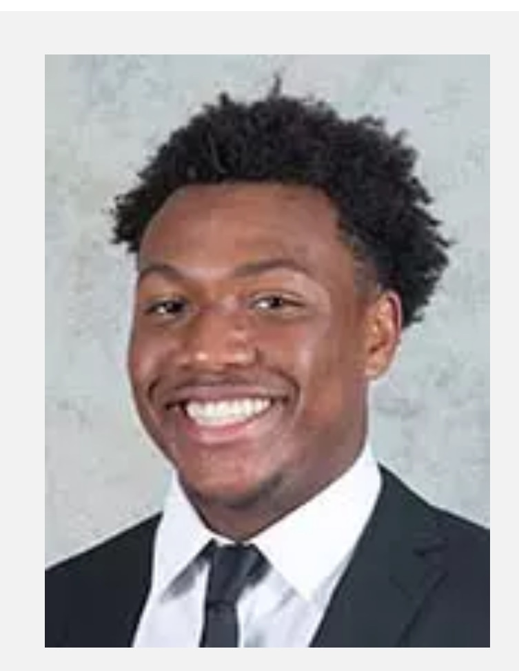

## About Me

My name is Julian Wilson
I am a student-athlete at Lehigh, majoring in Finance

<!-- Upload your own photo and change the path -->

  

_**[Regression Practice](asgn-07_exercises.md)**_

---

_**[Team project](https://finalprojectmichael.streamlit.app/)**_

---

_**[Some personal project](/pdf/sample_presentation.pdf)**_

---

## Career Objectives
I want to start my own investment firm where I would invest in Real Estate and stocks.
Stocks: My strategy is to use technical indicators such as simple-moving averages, RSI, and support/resistance levels to trade stocks and options. 
---

## Hobbies

I am a very active person. I love playing sports and engaging in outdoor activities such as playing basketball, working out, or going hiking.
I love listening to music, cooking, and watching shows/movies my favorite being Game of Thrones. 

---

Page template forked from <a href="https://github.com/evanca/quick-portfolio">evanca</a>

<!-- Remove above link if you don't want to attibute -->
