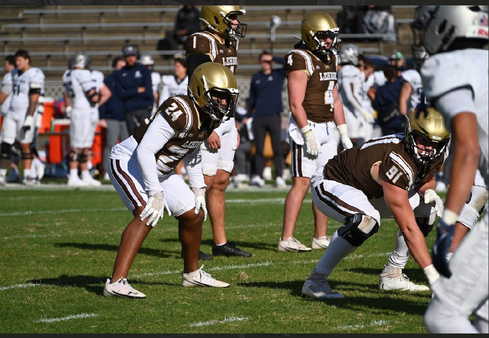

## About Me

Welcome! My name is Julian Wilson. I am a former Division 1 football student-athlete and Lehigh University graduate with a Bachelor’s degree in Finance. I am currently pursuing my Master of Professional Accountancy (MPAc) at the University of California, Davis, with CPA eligibility targeted for June 2027.  I aim to work at the intersection of accounting and finance in audit, financial modeling, valuation, and data analytics, using AI & programming tools like Python and Excel to solve complex business problems. Backed by a strong work ethic, adaptability, and high-stakes teamwork developed through competitive athletics, I bring a collaborative, growth-oriented mindset to engagement teams and client-facing roles.

<!-- Upload your own photo and change the path -->

  

_**[Regression Practice](asgn-07_exercises.md)**_

---

_**[Team Project](final_project/final_project.md)**_

---

_**[Real Estate Project](real_estate_project/project.md)**_

---

## Hobbies

Outside of my academic and professional pursuits, I stay active and creative through a variety of personal interests. I enjoy cooking, writing poetry, lifting weights, hiking, and playing sports, as well as unwinding with a good movie or TV show.

---

Page template forked from <a href="https://github.com/evanca/quick-portfolio">evanca</a>

<!-- Remove above link if you don't want to attibute -->
