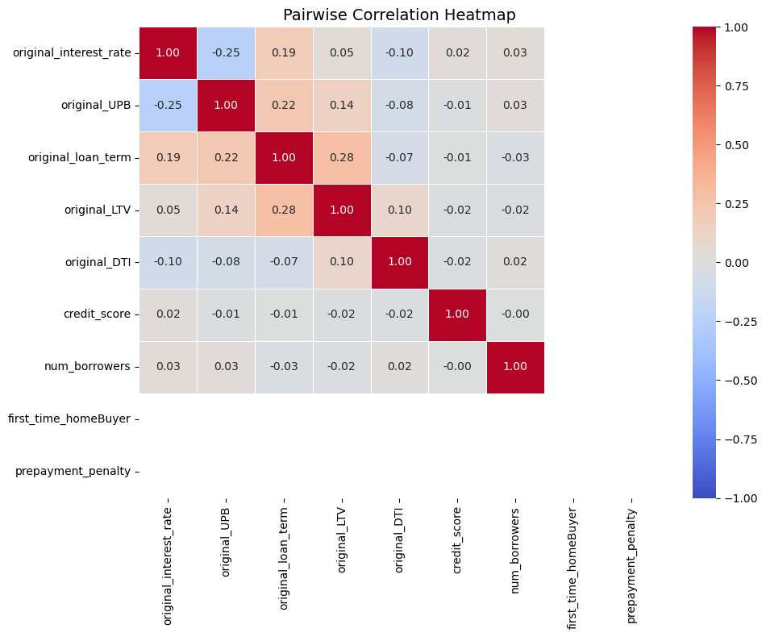

```python
# Necessary Packages
import pandas as pd
import seaborn as sns
import matplotlib.pyplot as plt
import numpy as np

data = pd.read_csv('Spring2025_Freddie_Assignment_Data.csv')

data.describe()
```


<div>
<style scoped>
    .dataframe tbody tr th:only-of-type {
        vertical-align: middle;
    }

    .dataframe tbody tr th {
        vertical-align: top;
    }

    .dataframe thead th {
        text-align: right;
    }
</style>
<table border="1" class="dataframe">
  <thead>
    <tr style="text-align: right;">
      <th></th>
      <th>oyear</th>
      <th>v1</th>
      <th>v2</th>
      <th>v4</th>
      <th>v5</th>
      <th>v6</th>
      <th>v7</th>
      <th>v9</th>
      <th>v10</th>
      <th>v11</th>
      <th>...</th>
      <th>v13</th>
      <th>v19</th>
      <th>v22</th>
      <th>v23</th>
      <th>v26</th>
      <th>v27</th>
      <th>v28</th>
      <th>v29</th>
      <th>v30</th>
      <th>v32</th>
    </tr>
  </thead>
  <tbody>
    <tr>
      <th>count</th>
      <td>75750.000000</td>
      <td>75750.000000</td>
      <td>75750.000000</td>
      <td>75750.000000</td>
      <td>59277.000000</td>
      <td>75750.000000</td>
      <td>75750.000000</td>
      <td>75750.000000</td>
      <td>75750.000000</td>
      <td>7.575000e+04</td>
      <td>...</td>
      <td>75750.000000</td>
      <td>75750.000000</td>
      <td>75750.000000</td>
      <td>75750.000000</td>
      <td>0.0</td>
      <td>0.0</td>
      <td>48000.0</td>
      <td>0.0</td>
      <td>75750.000000</td>
      <td>48000.0</td>
    </tr>
    <tr>
      <th>mean</th>
      <td>2011.128713</td>
      <td>757.886350</td>
      <td>201136.033083</td>
      <td>203757.123617</td>
      <td>30234.619363</td>
      <td>5.099815</td>
      <td>1.041175</td>
      <td>72.962416</td>
      <td>107.054944</td>
      <td>2.071092e+05</td>
      <td>...</td>
      <td>5.199447</td>
      <td>53107.857426</td>
      <td>315.481003</td>
      <td>1.570323</td>
      <td>NaN</td>
      <td>NaN</td>
      <td>9.0</td>
      <td>NaN</td>
      <td>6.951182</td>
      <td>9.0</td>
    </tr>
    <tr>
      <th>std</th>
      <td>7.289894</td>
      <td>401.078859</td>
      <td>728.706780</td>
      <td>1027.884130</td>
      <td>11308.227815</td>
      <td>11.633190</td>
      <td>1.146485</td>
      <td>19.617253</td>
      <td>255.444787</td>
      <td>1.252611e+05</td>
      <td>...</td>
      <td>1.440121</td>
      <td>29454.106497</td>
      <td>76.319966</td>
      <td>1.417295</td>
      <td>NaN</td>
      <td>NaN</td>
      <td>0.0</td>
      <td>NaN</td>
      <td>3.236903</td>
      <td>0.0</td>
    </tr>
    <tr>
      <th>min</th>
      <td>1999.000000</td>
      <td>300.000000</td>
      <td>199902.000000</td>
      <td>200703.000000</td>
      <td>10180.000000</td>
      <td>0.000000</td>
      <td>1.000000</td>
      <td>6.000000</td>
      <td>1.000000</td>
      <td>1.000000e+04</td>
      <td>...</td>
      <td>1.750000</td>
      <td>0.000000</td>
      <td>60.000000</td>
      <td>1.000000</td>
      <td>NaN</td>
      <td>NaN</td>
      <td>9.0</td>
      <td>NaN</td>
      <td>1.000000</td>
      <td>9.0</td>
    </tr>
    <tr>
      <th>25%</th>
      <td>2005.000000</td>
      <td>707.000000</td>
      <td>200507.000000</td>
      <td>203103.000000</td>
      <td>19124.000000</td>
      <td>0.000000</td>
      <td>1.000000</td>
      <td>62.000000</td>
      <td>27.000000</td>
      <td>1.150000e+05</td>
      <td>...</td>
      <td>4.125000</td>
      <td>29600.000000</td>
      <td>240.000000</td>
      <td>1.000000</td>
      <td>NaN</td>
      <td>NaN</td>
      <td>9.0</td>
      <td>NaN</td>
      <td>2.000000</td>
      <td>9.0</td>
    </tr>
    <tr>
      <th>50%</th>
      <td>2011.000000</td>
      <td>751.000000</td>
      <td>201110.000000</td>
      <td>203802.000000</td>
      <td>31540.000000</td>
      <td>0.000000</td>
      <td>1.000000</td>
      <td>77.000000</td>
      <td>36.000000</td>
      <td>1.780000e+05</td>
      <td>...</td>
      <td>5.000000</td>
      <td>50300.000000</td>
      <td>360.000000</td>
      <td>2.000000</td>
      <td>NaN</td>
      <td>NaN</td>
      <td>9.0</td>
      <td>NaN</td>
      <td>9.000000</td>
      <td>9.0</td>
    </tr>
    <tr>
      <th>75%</th>
      <td>2017.000000</td>
      <td>783.000000</td>
      <td>201802.000000</td>
      <td>204609.000000</td>
      <td>39900.000000</td>
      <td>0.000000</td>
      <td>1.000000</td>
      <td>85.000000</td>
      <td>44.000000</td>
      <td>2.720000e+05</td>
      <td>...</td>
      <td>6.250000</td>
      <td>80200.000000</td>
      <td>360.000000</td>
      <td>2.000000</td>
      <td>NaN</td>
      <td>NaN</td>
      <td>9.0</td>
      <td>NaN</td>
      <td>9.000000</td>
      <td>9.0</td>
    </tr>
    <tr>
      <th>max</th>
      <td>2024.000000</td>
      <td>9999.000000</td>
      <td>202406.000000</td>
      <td>205405.000000</td>
      <td>49740.000000</td>
      <td>999.000000</td>
      <td>99.000000</td>
      <td>469.000000</td>
      <td>999.000000</td>
      <td>1.564000e+06</td>
      <td>...</td>
      <td>12.850000</td>
      <td>99900.000000</td>
      <td>480.000000</td>
      <td>99.000000</td>
      <td>NaN</td>
      <td>NaN</td>
      <td>9.0</td>
      <td>NaN</td>
      <td>9.000000</td>
      <td>9.0</td>
    </tr>
  </tbody>
</table>
<p>8 rows × 21 columns</p>
</div>


```python
# 1
# Changes variable names 
variable_mapping = {
    'v13': 'original_interest_rate',
    'v11': 'original_UPB',
    'v22': 'original_loan_term',
    'v12': 'original_LTV', 
    'v10': 'original_DTI', 
    'v1': 'credit_score', 
    'v23': 'num_borrowers', 
    'v3': 'first_time_homeBuyer',
    'v15': 'prepayment_penalty', 
}

table_vars = data[list(variable_mapping.keys())].rename(columns=variable_mapping)

table_vars.describe()
```


<div>
<style scoped>
    .dataframe tbody tr th:only-of-type {
        vertical-align: middle;
    }

    .dataframe tbody tr th {
        vertical-align: top;
    }

    .dataframe thead th {
        text-align: right;
    }
</style>
<table border="1" class="dataframe">
  <thead>
    <tr style="text-align: right;">
      <th></th>
      <th>original_interest_rate</th>
      <th>original_UPB</th>
      <th>original_loan_term</th>
      <th>original_LTV</th>
      <th>original_DTI</th>
      <th>credit_score</th>
      <th>num_borrowers</th>
    </tr>
  </thead>
  <tbody>
    <tr>
      <th>count</th>
      <td>75750.000000</td>
      <td>7.575000e+04</td>
      <td>75750.000000</td>
      <td>75750.000000</td>
      <td>75750.000000</td>
      <td>75750.000000</td>
      <td>75750.000000</td>
    </tr>
    <tr>
      <th>mean</th>
      <td>5.199447</td>
      <td>2.071092e+05</td>
      <td>315.481003</td>
      <td>71.833135</td>
      <td>107.054944</td>
      <td>757.886350</td>
      <td>1.570323</td>
    </tr>
    <tr>
      <th>std</th>
      <td>1.440121</td>
      <td>1.252611e+05</td>
      <td>76.319966</td>
      <td>18.970866</td>
      <td>255.444787</td>
      <td>401.078859</td>
      <td>1.417295</td>
    </tr>
    <tr>
      <th>min</th>
      <td>1.750000</td>
      <td>1.000000e+04</td>
      <td>60.000000</td>
      <td>6.000000</td>
      <td>1.000000</td>
      <td>300.000000</td>
      <td>1.000000</td>
    </tr>
    <tr>
      <th>25%</th>
      <td>4.125000</td>
      <td>1.150000e+05</td>
      <td>240.000000</td>
      <td>61.000000</td>
      <td>27.000000</td>
      <td>707.000000</td>
      <td>1.000000</td>
    </tr>
    <tr>
      <th>50%</th>
      <td>5.000000</td>
      <td>1.780000e+05</td>
      <td>360.000000</td>
      <td>75.000000</td>
      <td>36.000000</td>
      <td>751.000000</td>
      <td>2.000000</td>
    </tr>
    <tr>
      <th>75%</th>
      <td>6.250000</td>
      <td>2.720000e+05</td>
      <td>360.000000</td>
      <td>80.000000</td>
      <td>44.000000</td>
      <td>783.000000</td>
      <td>2.000000</td>
    </tr>
    <tr>
      <th>max</th>
      <td>12.850000</td>
      <td>1.564000e+06</td>
      <td>480.000000</td>
      <td>386.000000</td>
      <td>999.000000</td>
      <td>9999.000000</td>
      <td>99.000000</td>
    </tr>
  </tbody>
</table>
</div>


```python
# 2
# Cleans the data 
table_vars_clean = table_vars.replace(['N', 'NA', '?', ''], np.nan)
table_vars_clean = table_vars_clean.apply(pd.to_numeric, errors='coerce')

corr_matrix = table_vars_clean.corr()

def color_correlations(val):
    if pd.isna(val):
        return 'background-color: white'
    color = 'red' if val < 0 else 'green'
    weight = abs(val)
    return f'color: {color}; background-color: rgba({255 if val > 0 else 0}, {255 - abs(val)*255}, {0}, {weight})'

# Create table
styled_corr = corr_matrix.style\
    .applymap(color_correlations)\
    .format("{:.2f}", na_rep="-")\
    .set_caption("Pairwise Correlations Between Variables")\
    .set_table_styles([
        {'selector': 'caption', 'props': [('font-size', '16px'), ('font-weight', 'bold')]}
    ])

display(styled_corr)

# Heatmap
plt.figure(figsize=(10, 8))
sns.heatmap(corr_matrix, 
            annot=True, 
            fmt=".2f", 
            cmap='coolwarm', 
            center=0,
            vmin=-1, 
            vmax=1,
            linewidths=.5,
            mask=corr_matrix.isnull())
plt.title('Pairwise Correlation Heatmap', fontsize=14)
plt.tight_layout()
plt.show()
```

    /var/folders/wg/83yd64j97z7gqxgfl1xm7dg80000gn/T/ipykernel_41656/4248349258.py:17: FutureWarning: Styler.applymap has been deprecated. Use Styler.map instead.
      .applymap(color_correlations)\


<style type="text/css">
#T_d1a22 caption {
  font-size: 16px;
  font-weight: bold;
}
#T_d1a22_row0_col0, #T_d1a22_row1_col1, #T_d1a22_row2_col2, #T_d1a22_row3_col3, #T_d1a22_row4_col4, #T_d1a22_row5_col5, #T_d1a22_row6_col6 {
  color: green;
  background-color: rgba(255, 0.0, 0, 1.0);
}
#T_d1a22_row0_col1, #T_d1a22_row1_col0 {
  color: red;
  background-color: rgba(0, 192.14703371629167, 0, 0.24648222072042483);
}
#T_d1a22_row0_col2, #T_d1a22_row2_col0 {
  color: green;
  background-color: rgba(255, 205.7174906878664, 0, 0.193264742400524);
}
#T_d1a22_row0_col3, #T_d1a22_row3_col0 {
  color: green;
  background-color: rgba(255, 243.37907364988075, 0, 0.0455722601965461);
}
#T_d1a22_row0_col4, #T_d1a22_row4_col0 {
  color: red;
  background-color: rgba(0, 229.25632755259522, 0, 0.10095557822511673);
}
#T_d1a22_row0_col5, #T_d1a22_row5_col0 {
  color: green;
  background-color: rgba(255, 249.02023623520228, 0, 0.02345005397959887);
}
#T_d1a22_row0_col6, #T_d1a22_row6_col0 {
  color: green;
  background-color: rgba(255, 246.45837130641303, 0, 0.03349658311210579);
}
#T_d1a22_row0_col7, #T_d1a22_row0_col8, #T_d1a22_row1_col7, #T_d1a22_row1_col8, #T_d1a22_row2_col7, #T_d1a22_row2_col8, #T_d1a22_row3_col7, #T_d1a22_row3_col8, #T_d1a22_row4_col7, #T_d1a22_row4_col8, #T_d1a22_row5_col7, #T_d1a22_row5_col8, #T_d1a22_row6_col7, #T_d1a22_row6_col8, #T_d1a22_row7_col0, #T_d1a22_row7_col1, #T_d1a22_row7_col2, #T_d1a22_row7_col3, #T_d1a22_row7_col4, #T_d1a22_row7_col5, #T_d1a22_row7_col6, #T_d1a22_row7_col7, #T_d1a22_row7_col8, #T_d1a22_row8_col0, #T_d1a22_row8_col1, #T_d1a22_row8_col2, #T_d1a22_row8_col3, #T_d1a22_row8_col4, #T_d1a22_row8_col5, #T_d1a22_row8_col6, #T_d1a22_row8_col7, #T_d1a22_row8_col8 {
  background-color: white;
}
#T_d1a22_row1_col2, #T_d1a22_row2_col1 {
  color: green;
  background-color: rgba(255, 199.11547512827497, 0, 0.21915499949696085);
}
#T_d1a22_row1_col3, #T_d1a22_row3_col1 {
  color: green;
  background-color: rgba(255, 220.55335496362824, 0, 0.13508488249557554);
}
#T_d1a22_row1_col4, #T_d1a22_row4_col1 {
  color: red;
  background-color: rgba(0, 235.72928333600274, 0, 0.07557143789802843);
}
#T_d1a22_row1_col5, #T_d1a22_row5_col1 {
  color: red;
  background-color: rgba(0, 252.41679187934685, 0, 0.010130227924129986);
}
#T_d1a22_row1_col6, #T_d1a22_row6_col1 {
  color: green;
  background-color: rgba(255, 248.6161113428787, 0, 0.025034857478907054);
}
#T_d1a22_row2_col3, #T_d1a22_row3_col2 {
  color: green;
  background-color: rgba(255, 182.59873297913327, 0, 0.2839265373367322);
}
#T_d1a22_row2_col4, #T_d1a22_row4_col2 {
  color: red;
  background-color: rgba(0, 237.52514183507586, 0, 0.06852885554872216);
}
#T_d1a22_row2_col5, #T_d1a22_row5_col2 {
  color: red;
  background-color: rgba(0, 253.66379777478548, 0, 0.005240008726331419);
}
#T_d1a22_row2_col6, #T_d1a22_row6_col2 {
  color: red;
  background-color: rgba(0, 247.58076796238393, 0, 0.02909502759849439);
}
#T_d1a22_row3_col4, #T_d1a22_row4_col3 {
  color: green;
  background-color: rgba(255, 230.19029845998676, 0, 0.0972929472157382);
}
#T_d1a22_row3_col5, #T_d1a22_row5_col3 {
  color: red;
  background-color: rgba(0, 251.07556353906585, 0, 0.015389946905624069);
}
#T_d1a22_row3_col6, #T_d1a22_row6_col3 {
  color: red;
  background-color: rgba(0, 249.77687818410553, 0, 0.020482830650566577);
}
#T_d1a22_row4_col5, #T_d1a22_row5_col4 {
  color: red;
  background-color: rgba(0, 250.94226447112266, 0, 0.015912688348538588);
}
#T_d1a22_row4_col6, #T_d1a22_row6_col4 {
  color: green;
  background-color: rgba(255, 251.0714150994423, 0, 0.015406215296304659);
}
#T_d1a22_row5_col6, #T_d1a22_row6_col5 {
  color: red;
  background-color: rgba(0, 253.9630752195681, 0, 0.004066371687968209);
}
</style>
<table id="T_d1a22">
  <caption>Pairwise Correlations Between Variables</caption>
  <thead>
    <tr>
      <th class="blank level0" >&nbsp;</th>
      <th id="T_d1a22_level0_col0" class="col_heading level0 col0" >original_interest_rate</th>
      <th id="T_d1a22_level0_col1" class="col_heading level0 col1" >original_UPB</th>
      <th id="T_d1a22_level0_col2" class="col_heading level0 col2" >original_loan_term</th>
      <th id="T_d1a22_level0_col3" class="col_heading level0 col3" >original_LTV</th>
      <th id="T_d1a22_level0_col4" class="col_heading level0 col4" >original_DTI</th>
      <th id="T_d1a22_level0_col5" class="col_heading level0 col5" >credit_score</th>
      <th id="T_d1a22_level0_col6" class="col_heading level0 col6" >num_borrowers</th>
      <th id="T_d1a22_level0_col7" class="col_heading level0 col7" >first_time_homeBuyer</th>
      <th id="T_d1a22_level0_col8" class="col_heading level0 col8" >prepayment_penalty</th>
    </tr>
  </thead>
  <tbody>
    <tr>
      <th id="T_d1a22_level0_row0" class="row_heading level0 row0" >original_interest_rate</th>
      <td id="T_d1a22_row0_col0" class="data row0 col0" >1.00</td>
      <td id="T_d1a22_row0_col1" class="data row0 col1" >-0.25</td>
      <td id="T_d1a22_row0_col2" class="data row0 col2" >0.19</td>
      <td id="T_d1a22_row0_col3" class="data row0 col3" >0.05</td>
      <td id="T_d1a22_row0_col4" class="data row0 col4" >-0.10</td>
      <td id="T_d1a22_row0_col5" class="data row0 col5" >0.02</td>
      <td id="T_d1a22_row0_col6" class="data row0 col6" >0.03</td>
      <td id="T_d1a22_row0_col7" class="data row0 col7" >-</td>
      <td id="T_d1a22_row0_col8" class="data row0 col8" >-</td>
    </tr>
    <tr>
      <th id="T_d1a22_level0_row1" class="row_heading level0 row1" >original_UPB</th>
      <td id="T_d1a22_row1_col0" class="data row1 col0" >-0.25</td>
      <td id="T_d1a22_row1_col1" class="data row1 col1" >1.00</td>
      <td id="T_d1a22_row1_col2" class="data row1 col2" >0.22</td>
      <td id="T_d1a22_row1_col3" class="data row1 col3" >0.14</td>
      <td id="T_d1a22_row1_col4" class="data row1 col4" >-0.08</td>
      <td id="T_d1a22_row1_col5" class="data row1 col5" >-0.01</td>
      <td id="T_d1a22_row1_col6" class="data row1 col6" >0.03</td>
      <td id="T_d1a22_row1_col7" class="data row1 col7" >-</td>
      <td id="T_d1a22_row1_col8" class="data row1 col8" >-</td>
    </tr>
    <tr>
      <th id="T_d1a22_level0_row2" class="row_heading level0 row2" >original_loan_term</th>
      <td id="T_d1a22_row2_col0" class="data row2 col0" >0.19</td>
      <td id="T_d1a22_row2_col1" class="data row2 col1" >0.22</td>
      <td id="T_d1a22_row2_col2" class="data row2 col2" >1.00</td>
      <td id="T_d1a22_row2_col3" class="data row2 col3" >0.28</td>
      <td id="T_d1a22_row2_col4" class="data row2 col4" >-0.07</td>
      <td id="T_d1a22_row2_col5" class="data row2 col5" >-0.01</td>
      <td id="T_d1a22_row2_col6" class="data row2 col6" >-0.03</td>
      <td id="T_d1a22_row2_col7" class="data row2 col7" >-</td>
      <td id="T_d1a22_row2_col8" class="data row2 col8" >-</td>
    </tr>
    <tr>
      <th id="T_d1a22_level0_row3" class="row_heading level0 row3" >original_LTV</th>
      <td id="T_d1a22_row3_col0" class="data row3 col0" >0.05</td>
      <td id="T_d1a22_row3_col1" class="data row3 col1" >0.14</td>
      <td id="T_d1a22_row3_col2" class="data row3 col2" >0.28</td>
      <td id="T_d1a22_row3_col3" class="data row3 col3" >1.00</td>
      <td id="T_d1a22_row3_col4" class="data row3 col4" >0.10</td>
      <td id="T_d1a22_row3_col5" class="data row3 col5" >-0.02</td>
      <td id="T_d1a22_row3_col6" class="data row3 col6" >-0.02</td>
      <td id="T_d1a22_row3_col7" class="data row3 col7" >-</td>
      <td id="T_d1a22_row3_col8" class="data row3 col8" >-</td>
    </tr>
    <tr>
      <th id="T_d1a22_level0_row4" class="row_heading level0 row4" >original_DTI</th>
      <td id="T_d1a22_row4_col0" class="data row4 col0" >-0.10</td>
      <td id="T_d1a22_row4_col1" class="data row4 col1" >-0.08</td>
      <td id="T_d1a22_row4_col2" class="data row4 col2" >-0.07</td>
      <td id="T_d1a22_row4_col3" class="data row4 col3" >0.10</td>
      <td id="T_d1a22_row4_col4" class="data row4 col4" >1.00</td>
      <td id="T_d1a22_row4_col5" class="data row4 col5" >-0.02</td>
      <td id="T_d1a22_row4_col6" class="data row4 col6" >0.02</td>
      <td id="T_d1a22_row4_col7" class="data row4 col7" >-</td>
      <td id="T_d1a22_row4_col8" class="data row4 col8" >-</td>
    </tr>
    <tr>
      <th id="T_d1a22_level0_row5" class="row_heading level0 row5" >credit_score</th>
      <td id="T_d1a22_row5_col0" class="data row5 col0" >0.02</td>
      <td id="T_d1a22_row5_col1" class="data row5 col1" >-0.01</td>
      <td id="T_d1a22_row5_col2" class="data row5 col2" >-0.01</td>
      <td id="T_d1a22_row5_col3" class="data row5 col3" >-0.02</td>
      <td id="T_d1a22_row5_col4" class="data row5 col4" >-0.02</td>
      <td id="T_d1a22_row5_col5" class="data row5 col5" >1.00</td>
      <td id="T_d1a22_row5_col6" class="data row5 col6" >-0.00</td>
      <td id="T_d1a22_row5_col7" class="data row5 col7" >-</td>
      <td id="T_d1a22_row5_col8" class="data row5 col8" >-</td>
    </tr>
    <tr>
      <th id="T_d1a22_level0_row6" class="row_heading level0 row6" >num_borrowers</th>
      <td id="T_d1a22_row6_col0" class="data row6 col0" >0.03</td>
      <td id="T_d1a22_row6_col1" class="data row6 col1" >0.03</td>
      <td id="T_d1a22_row6_col2" class="data row6 col2" >-0.03</td>
      <td id="T_d1a22_row6_col3" class="data row6 col3" >-0.02</td>
      <td id="T_d1a22_row6_col4" class="data row6 col4" >0.02</td>
      <td id="T_d1a22_row6_col5" class="data row6 col5" >-0.00</td>
      <td id="T_d1a22_row6_col6" class="data row6 col6" >1.00</td>
      <td id="T_d1a22_row6_col7" class="data row6 col7" >-</td>
      <td id="T_d1a22_row6_col8" class="data row6 col8" >-</td>
    </tr>
    <tr>
      <th id="T_d1a22_level0_row7" class="row_heading level0 row7" >first_time_homeBuyer</th>
      <td id="T_d1a22_row7_col0" class="data row7 col0" >-</td>
      <td id="T_d1a22_row7_col1" class="data row7 col1" >-</td>
      <td id="T_d1a22_row7_col2" class="data row7 col2" >-</td>
      <td id="T_d1a22_row7_col3" class="data row7 col3" >-</td>
      <td id="T_d1a22_row7_col4" class="data row7 col4" >-</td>
      <td id="T_d1a22_row7_col5" class="data row7 col5" >-</td>
      <td id="T_d1a22_row7_col6" class="data row7 col6" >-</td>
      <td id="T_d1a22_row7_col7" class="data row7 col7" >-</td>
      <td id="T_d1a22_row7_col8" class="data row7 col8" >-</td>
    </tr>
    <tr>
      <th id="T_d1a22_level0_row8" class="row_heading level0 row8" >prepayment_penalty</th>
      <td id="T_d1a22_row8_col0" class="data row8 col0" >-</td>
      <td id="T_d1a22_row8_col1" class="data row8 col1" >-</td>
      <td id="T_d1a22_row8_col2" class="data row8 col2" >-</td>
      <td id="T_d1a22_row8_col3" class="data row8 col3" >-</td>
      <td id="T_d1a22_row8_col4" class="data row8 col4" >-</td>
      <td id="T_d1a22_row8_col5" class="data row8 col5" >-</td>
      <td id="T_d1a22_row8_col6" class="data row8 col6" >-</td>
      <td id="T_d1a22_row8_col7" class="data row8 col7" >-</td>
      <td id="T_d1a22_row8_col8" class="data row8 col8" >-</td>
    </tr>
  </tbody>
</table>


    

    


```python
# 3
import pandas as pd

variable_mapping = {
    'v13': 'original_interest_rate',
    'v11': 'original_UPB',
    'v22': 'original_loan_term',
    'v12': 'original_LTV', 
    'v10': 'original_DTI', 
    'v1': 'credit_score', 
    'v23': 'num_borrowers', 
    'v3': 'first_time_homeBuyer',
    'v15': 'prepayment_penalty',
    'v8': 'loan_purpose'   
}

table_vars = data[list(variable_mapping.keys())].rename(columns=variable_mapping)

table_vars['origination_year'] = data['oyear']  

summary_table = table_vars.groupby('origination_year').agg({
    'original_interest_rate': 'mean',
    'loan_purpose': lambda x: x.isin(['P', 'S']).sum(),  
    'original_UPB': 'mean',
    'original_LTV': 'mean',
    'original_DTI': 'mean',
    'credit_score': ['mean', lambda x: (x < 680).mean()],
    'num_borrowers': lambda x: (x == 1).mean()
})

summary_table.columns = [
    'mean_interest_rate', 
    'count_purchase_loans', 
    'mean_UPB', 
    'mean_LTV', 
    'mean_DTI', 
    'mean_FICO', 
    'pct_FICO_under_680', 
    'pct_single_borrower'
]

#Creates the totals row
totals_row = pd.DataFrame({
    'mean_interest_rate': table_vars['original_interest_rate'].mean(),
    'count_purchase_loans': table_vars['loan_purpose'].isin(['P', 'S']).sum(),  
    'mean_UPB': table_vars['original_UPB'].mean(),
    'mean_LTV': table_vars['original_LTV'].mean(),
    'mean_DTI': table_vars['original_DTI'].mean(),
    'mean_FICO': table_vars['credit_score'].mean(),
    'pct_FICO_under_680': (table_vars['credit_score'] < 680).mean(),
    'pct_single_borrower': (table_vars['num_borrowers'] == 1).mean()
}, index=['Total'])

# Combine and format
final_table = pd.concat([summary_table, totals_row]).style\
    .format({
        'mean_interest_rate': '{:.2f}%',
        'mean_UPB': '${:,.0f}',
        'mean_LTV': '{:.1f}%',
        'mean_DTI': '{:.1f}%',
        'mean_FICO': '{:.0f}',
        'pct_FICO_under_680': '{:.1%}',
        'pct_single_borrower': '{:.1%}',
        'count_purchase_loans': '{:,.0f}'
    })

display(final_table)
```


<style type="text/css">
</style>
<table id="T_9a36b">
  <thead>
    <tr>
      <th class="blank level0" >&nbsp;</th>
      <th id="T_9a36b_level0_col0" class="col_heading level0 col0" >mean_interest_rate</th>
      <th id="T_9a36b_level0_col1" class="col_heading level0 col1" >count_purchase_loans</th>
      <th id="T_9a36b_level0_col2" class="col_heading level0 col2" >mean_UPB</th>
      <th id="T_9a36b_level0_col3" class="col_heading level0 col3" >mean_LTV</th>
      <th id="T_9a36b_level0_col4" class="col_heading level0 col4" >mean_DTI</th>
      <th id="T_9a36b_level0_col5" class="col_heading level0 col5" >mean_FICO</th>
      <th id="T_9a36b_level0_col6" class="col_heading level0 col6" >pct_FICO_under_680</th>
      <th id="T_9a36b_level0_col7" class="col_heading level0 col7" >pct_single_borrower</th>
    </tr>
  </thead>
  <tbody>
    <tr>
      <th id="T_9a36b_level0_row0" class="row_heading level0 row0" >1999</th>
      <td id="T_9a36b_row0_col0" class="data row0 col0" >7.33%</td>
      <td id="T_9a36b_row0_col1" class="data row0 col1" >2,854</td>
      <td id="T_9a36b_row0_col2" class="data row0 col2" >$115,213</td>
      <td id="T_9a36b_row0_col3" class="data row0 col3" >71.4%</td>
      <td id="T_9a36b_row0_col4" class="data row0 col4" >75.3%</td>
      <td id="T_9a36b_row0_col5" class="data row0 col5" >807</td>
      <td id="T_9a36b_row0_col6" class="data row0 col6" >26.1%</td>
      <td id="T_9a36b_row0_col7" class="data row0 col7" >34.6%</td>
    </tr>
    <tr>
      <th id="T_9a36b_level0_row1" class="row_heading level0 row1" >2000</th>
      <td id="T_9a36b_row1_col0" class="data row1 col0" >8.13%</td>
      <td id="T_9a36b_row1_col1" class="data row1 col1" >2,833</td>
      <td id="T_9a36b_row1_col2" class="data row1 col2" >$122,997</td>
      <td id="T_9a36b_row1_col3" class="data row1 col3" >72.6%</td>
      <td id="T_9a36b_row1_col4" class="data row1 col4" >57.2%</td>
      <td id="T_9a36b_row1_col5" class="data row1 col5" >864</td>
      <td id="T_9a36b_row1_col6" class="data row1 col6" >26.1%</td>
      <td id="T_9a36b_row1_col7" class="data row1 col7" >39.4%</td>
    </tr>
    <tr>
      <th id="T_9a36b_level0_row2" class="row_heading level0 row2" >2001</th>
      <td id="T_9a36b_row2_col0" class="data row2 col0" >6.86%</td>
      <td id="T_9a36b_row2_col1" class="data row2 col1" >2,885</td>
      <td id="T_9a36b_row2_col2" class="data row2 col2" >$138,176</td>
      <td id="T_9a36b_row2_col3" class="data row2 col3" >70.5%</td>
      <td id="T_9a36b_row2_col4" class="data row2 col4" >53.9%</td>
      <td id="T_9a36b_row2_col5" class="data row2 col5" >773</td>
      <td id="T_9a36b_row2_col6" class="data row2 col6" >23.3%</td>
      <td id="T_9a36b_row2_col7" class="data row2 col7" >34.0%</td>
    </tr>
    <tr>
      <th id="T_9a36b_level0_row3" class="row_heading level0 row3" >2002</th>
      <td id="T_9a36b_row3_col0" class="data row3 col0" >6.40%</td>
      <td id="T_9a36b_row3_col1" class="data row3 col1" >2,855</td>
      <td id="T_9a36b_row3_col2" class="data row3 col2" >$143,826</td>
      <td id="T_9a36b_row3_col3" class="data row3 col3" >68.3%</td>
      <td id="T_9a36b_row3_col4" class="data row3 col4" >52.3%</td>
      <td id="T_9a36b_row3_col5" class="data row3 col5" >807</td>
      <td id="T_9a36b_row3_col6" class="data row3 col6" >21.2%</td>
      <td id="T_9a36b_row3_col7" class="data row3 col7" >34.2%</td>
    </tr>
    <tr>
      <th id="T_9a36b_level0_row4" class="row_heading level0 row4" >2003</th>
      <td id="T_9a36b_row4_col0" class="data row4 col0" >5.53%</td>
      <td id="T_9a36b_row4_col1" class="data row4 col1" >2,901</td>
      <td id="T_9a36b_row4_col2" class="data row4 col2" >$141,283</td>
      <td id="T_9a36b_row4_col3" class="data row4 col3" >66.3%</td>
      <td id="T_9a36b_row4_col4" class="data row4 col4" >48.0%</td>
      <td id="T_9a36b_row4_col5" class="data row4 col5" >733</td>
      <td id="T_9a36b_row4_col6" class="data row4 col6" >18.0%</td>
      <td id="T_9a36b_row4_col7" class="data row4 col7" >32.8%</td>
    </tr>
    <tr>
      <th id="T_9a36b_level0_row5" class="row_heading level0 row5" >2004</th>
      <td id="T_9a36b_row5_col0" class="data row5 col0" >5.67%</td>
      <td id="T_9a36b_row5_col1" class="data row5 col1" >2,885</td>
      <td id="T_9a36b_row5_col2" class="data row5 col2" >$157,035</td>
      <td id="T_9a36b_row5_col3" class="data row5 col3" >68.7%</td>
      <td id="T_9a36b_row5_col4" class="data row5 col4" >52.2%</td>
      <td id="T_9a36b_row5_col5" class="data row5 col5" >732</td>
      <td id="T_9a36b_row5_col6" class="data row5 col6" >22.7%</td>
      <td id="T_9a36b_row5_col7" class="data row5 col7" >38.7%</td>
    </tr>
    <tr>
      <th id="T_9a36b_level0_row6" class="row_heading level0 row6" >2005</th>
      <td id="T_9a36b_row6_col0" class="data row6 col0" >5.81%</td>
      <td id="T_9a36b_row6_col1" class="data row6 col1" >2,894</td>
      <td id="T_9a36b_row6_col2" class="data row6 col2" >$170,089</td>
      <td id="T_9a36b_row6_col3" class="data row6 col3" >69.5%</td>
      <td id="T_9a36b_row6_col4" class="data row6 col4" >61.9%</td>
      <td id="T_9a36b_row6_col5" class="data row6 col5" >729</td>
      <td id="T_9a36b_row6_col6" class="data row6 col6" >23.4%</td>
      <td id="T_9a36b_row6_col7" class="data row6 col7" >42.3%</td>
    </tr>
    <tr>
      <th id="T_9a36b_level0_row7" class="row_heading level0 row7" >2006</th>
      <td id="T_9a36b_row7_col0" class="data row7 col0" >6.41%</td>
      <td id="T_9a36b_row7_col1" class="data row7 col1" >2,856</td>
      <td id="T_9a36b_row7_col2" class="data row7 col2" >$179,737</td>
      <td id="T_9a36b_row7_col3" class="data row7 col3" >70.1%</td>
      <td id="T_9a36b_row7_col4" class="data row7 col4" >57.5%</td>
      <td id="T_9a36b_row7_col5" class="data row7 col5" >723</td>
      <td id="T_9a36b_row7_col6" class="data row7 col6" >24.4%</td>
      <td id="T_9a36b_row7_col7" class="data row7 col7" >44.6%</td>
    </tr>
    <tr>
      <th id="T_9a36b_level0_row8" class="row_heading level0 row8" >2007</th>
      <td id="T_9a36b_row8_col0" class="data row8 col0" >6.37%</td>
      <td id="T_9a36b_row8_col1" class="data row8 col1" >2,784</td>
      <td id="T_9a36b_row8_col2" class="data row8 col2" >$181,224</td>
      <td id="T_9a36b_row8_col3" class="data row8 col3" >71.4%</td>
      <td id="T_9a36b_row8_col4" class="data row8 col4" >56.6%</td>
      <td id="T_9a36b_row8_col5" class="data row8 col5" >730</td>
      <td id="T_9a36b_row8_col6" class="data row8 col6" >22.2%</td>
      <td id="T_9a36b_row8_col7" class="data row8 col7" >46.0%</td>
    </tr>
    <tr>
      <th id="T_9a36b_level0_row9" class="row_heading level0 row9" >2008</th>
      <td id="T_9a36b_row9_col0" class="data row9 col0" >6.06%</td>
      <td id="T_9a36b_row9_col1" class="data row9 col1" >2,792</td>
      <td id="T_9a36b_row9_col2" class="data row9 col2" >$202,259</td>
      <td id="T_9a36b_row9_col3" class="data row9 col3" >70.0%</td>
      <td id="T_9a36b_row9_col4" class="data row9 col4" >55.0%</td>
      <td id="T_9a36b_row9_col5" class="data row9 col5" >747</td>
      <td id="T_9a36b_row9_col6" class="data row9 col6" >14.3%</td>
      <td id="T_9a36b_row9_col7" class="data row9 col7" >46.2%</td>
    </tr>
    <tr>
      <th id="T_9a36b_level0_row10" class="row_heading level0 row10" >2009</th>
      <td id="T_9a36b_row10_col0" class="data row10 col0" >4.97%</td>
      <td id="T_9a36b_row10_col1" class="data row10 col1" >2,903</td>
      <td id="T_9a36b_row10_col2" class="data row10 col2" >$214,531</td>
      <td id="T_9a36b_row10_col3" class="data row10 col3" >66.8%</td>
      <td id="T_9a36b_row10_col4" class="data row10 col4" >132.8%</td>
      <td id="T_9a36b_row10_col5" class="data row10 col5" >760</td>
      <td id="T_9a36b_row10_col6" class="data row10 col6" >5.5%</td>
      <td id="T_9a36b_row10_col7" class="data row10 col7" >37.7%</td>
    </tr>
    <tr>
      <th id="T_9a36b_level0_row11" class="row_heading level0 row11" >2010</th>
      <td id="T_9a36b_row11_col0" class="data row11 col0" >4.72%</td>
      <td id="T_9a36b_row11_col1" class="data row11 col1" >2,878</td>
      <td id="T_9a36b_row11_col2" class="data row11 col2" >$207,142</td>
      <td id="T_9a36b_row11_col3" class="data row11 col3" >68.3%</td>
      <td id="T_9a36b_row11_col4" class="data row11 col4" >307.5%</td>
      <td id="T_9a36b_row11_col5" class="data row11 col5" >761</td>
      <td id="T_9a36b_row11_col6" class="data row11 col6" >5.3%</td>
      <td id="T_9a36b_row11_col7" class="data row11 col7" >38.8%</td>
    </tr>
    <tr>
      <th id="T_9a36b_level0_row12" class="row_heading level0 row12" >2011</th>
      <td id="T_9a36b_row12_col0" class="data row12 col0" >4.41%</td>
      <td id="T_9a36b_row12_col1" class="data row12 col1" >2,821</td>
      <td id="T_9a36b_row12_col2" class="data row12 col2" >$206,570</td>
      <td id="T_9a36b_row12_col3" class="data row12 col3" >69.5%</td>
      <td id="T_9a36b_row12_col4" class="data row12 col4" >326.2%</td>
      <td id="T_9a36b_row12_col5" class="data row12 col5" >763</td>
      <td id="T_9a36b_row12_col6" class="data row12 col6" >6.1%</td>
      <td id="T_9a36b_row12_col7" class="data row12 col7" >41.1%</td>
    </tr>
    <tr>
      <th id="T_9a36b_level0_row13" class="row_heading level0 row13" >2012</th>
      <td id="T_9a36b_row13_col0" class="data row13 col0" >3.76%</td>
      <td id="T_9a36b_row13_col1" class="data row13 col1" >2,815</td>
      <td id="T_9a36b_row13_col2" class="data row13 col2" >$203,145</td>
      <td id="T_9a36b_row13_col3" class="data row13 col3" >76.2%</td>
      <td id="T_9a36b_row13_col4" class="data row13 col4" >368.4%</td>
      <td id="T_9a36b_row13_col5" class="data row13 col5" >757</td>
      <td id="T_9a36b_row13_col6" class="data row13 col6" >7.4%</td>
      <td id="T_9a36b_row13_col7" class="data row13 col7" >40.1%</td>
    </tr>
    <tr>
      <th id="T_9a36b_level0_row14" class="row_heading level0 row14" >2013</th>
      <td id="T_9a36b_row14_col0" class="data row14 col0" >3.94%</td>
      <td id="T_9a36b_row14_col1" class="data row14 col1" >2,674</td>
      <td id="T_9a36b_row14_col2" class="data row14 col2" >$201,935</td>
      <td id="T_9a36b_row14_col3" class="data row14 col3" >75.8%</td>
      <td id="T_9a36b_row14_col4" class="data row14 col4" >322.1%</td>
      <td id="T_9a36b_row14_col5" class="data row14 col5" >750</td>
      <td id="T_9a36b_row14_col6" class="data row14 col6" >10.0%</td>
      <td id="T_9a36b_row14_col7" class="data row14 col7" >45.0%</td>
    </tr>
    <tr>
      <th id="T_9a36b_level0_row15" class="row_heading level0 row15" >2014</th>
      <td id="T_9a36b_row15_col0" class="data row15 col0" >4.31%</td>
      <td id="T_9a36b_row15_col1" class="data row15 col1" >2,713</td>
      <td id="T_9a36b_row15_col2" class="data row15 col2" >$210,464</td>
      <td id="T_9a36b_row15_col3" class="data row15 col3" >75.6%</td>
      <td id="T_9a36b_row15_col4" class="data row15 col4" >172.4%</td>
      <td id="T_9a36b_row15_col5" class="data row15 col5" >747</td>
      <td id="T_9a36b_row15_col6" class="data row15 col6" >10.8%</td>
      <td id="T_9a36b_row15_col7" class="data row15 col7" >49.7%</td>
    </tr>
    <tr>
      <th id="T_9a36b_level0_row16" class="row_heading level0 row16" >2015</th>
      <td id="T_9a36b_row16_col0" class="data row16 col0" >3.97%</td>
      <td id="T_9a36b_row16_col1" class="data row16 col1" >2,749</td>
      <td id="T_9a36b_row16_col2" class="data row16 col2" >$224,247</td>
      <td id="T_9a36b_row16_col3" class="data row16 col3" >73.7%</td>
      <td id="T_9a36b_row16_col4" class="data row16 col4" >114.4%</td>
      <td id="T_9a36b_row16_col5" class="data row16 col5" >753</td>
      <td id="T_9a36b_row16_col6" class="data row16 col6" >8.6%</td>
      <td id="T_9a36b_row16_col7" class="data row16 col7" >49.2%</td>
    </tr>
    <tr>
      <th id="T_9a36b_level0_row17" class="row_heading level0 row17" >2016</th>
      <td id="T_9a36b_row17_col0" class="data row17 col0" >3.79%</td>
      <td id="T_9a36b_row17_col1" class="data row17 col1" >2,743</td>
      <td id="T_9a36b_row17_col2" class="data row17 col2" >$230,306</td>
      <td id="T_9a36b_row17_col3" class="data row17 col3" >73.4%</td>
      <td id="T_9a36b_row17_col4" class="data row17 col4" >83.1%</td>
      <td id="T_9a36b_row17_col5" class="data row17 col5" >747</td>
      <td id="T_9a36b_row17_col6" class="data row17 col6" >9.3%</td>
      <td id="T_9a36b_row17_col7" class="data row17 col7" >49.8%</td>
    </tr>
    <tr>
      <th id="T_9a36b_level0_row18" class="row_heading level0 row18" >2017</th>
      <td id="T_9a36b_row18_col0" class="data row18 col0" >4.19%</td>
      <td id="T_9a36b_row18_col1" class="data row18 col1" >2,721</td>
      <td id="T_9a36b_row18_col2" class="data row18 col2" >$230,048</td>
      <td id="T_9a36b_row18_col3" class="data row18 col3" >75.4%</td>
      <td id="T_9a36b_row18_col4" class="data row18 col4" >72.9%</td>
      <td id="T_9a36b_row18_col5" class="data row18 col5" >745</td>
      <td id="T_9a36b_row18_col6" class="data row18 col6" >10.0%</td>
      <td id="T_9a36b_row18_col7" class="data row18 col7" >51.8%</td>
    </tr>
    <tr>
      <th id="T_9a36b_level0_row19" class="row_heading level0 row19" >2018</th>
      <td id="T_9a36b_row19_col0" class="data row19 col0" >4.74%</td>
      <td id="T_9a36b_row19_col1" class="data row19 col1" >2,764</td>
      <td id="T_9a36b_row19_col2" class="data row19 col2" >$233,561</td>
      <td id="T_9a36b_row19_col3" class="data row19 col3" >76.3%</td>
      <td id="T_9a36b_row19_col4" class="data row19 col4" >44.7%</td>
      <td id="T_9a36b_row19_col5" class="data row19 col5" >746</td>
      <td id="T_9a36b_row19_col6" class="data row19 col6" >9.3%</td>
      <td id="T_9a36b_row19_col7" class="data row19 col7" >54.3%</td>
    </tr>
    <tr>
      <th id="T_9a36b_level0_row20" class="row_heading level0 row20" >2019</th>
      <td id="T_9a36b_row20_col0" class="data row20 col0" >4.22%</td>
      <td id="T_9a36b_row20_col1" class="data row20 col1" >2,815</td>
      <td id="T_9a36b_row20_col2" class="data row20 col2" >$256,121</td>
      <td id="T_9a36b_row20_col3" class="data row20 col3" >75.6%</td>
      <td id="T_9a36b_row20_col4" class="data row20 col4" >37.3%</td>
      <td id="T_9a36b_row20_col5" class="data row20 col5" >760</td>
      <td id="T_9a36b_row20_col6" class="data row20 col6" >7.1%</td>
      <td id="T_9a36b_row20_col7" class="data row20 col7" >53.4%</td>
    </tr>
    <tr>
      <th id="T_9a36b_level0_row21" class="row_heading level0 row21" >2020</th>
      <td id="T_9a36b_row21_col0" class="data row21 col0" >3.20%</td>
      <td id="T_9a36b_row21_col1" class="data row21 col1" >2,876</td>
      <td id="T_9a36b_row21_col2" class="data row21 col2" >$288,376</td>
      <td id="T_9a36b_row21_col3" class="data row21 col3" >71.3%</td>
      <td id="T_9a36b_row21_col4" class="data row21 col4" >33.5%</td>
      <td id="T_9a36b_row21_col5" class="data row21 col5" >762</td>
      <td id="T_9a36b_row21_col6" class="data row21 col6" >5.2%</td>
      <td id="T_9a36b_row21_col7" class="data row21 col7" >51.6%</td>
    </tr>
    <tr>
      <th id="T_9a36b_level0_row22" class="row_heading level0 row22" >2021</th>
      <td id="T_9a36b_row22_col0" class="data row22 col0" >2.97%</td>
      <td id="T_9a36b_row22_col1" class="data row22 col1" >2,856</td>
      <td id="T_9a36b_row22_col2" class="data row22 col2" >$285,795</td>
      <td id="T_9a36b_row22_col3" class="data row22 col3" >69.3%</td>
      <td id="T_9a36b_row22_col4" class="data row22 col4" >34.0%</td>
      <td id="T_9a36b_row22_col5" class="data row22 col5" >752</td>
      <td id="T_9a36b_row22_col6" class="data row22 col6" >7.6%</td>
      <td id="T_9a36b_row22_col7" class="data row22 col7" >54.3%</td>
    </tr>
    <tr>
      <th id="T_9a36b_level0_row23" class="row_heading level0 row23" >2022</th>
      <td id="T_9a36b_row23_col0" class="data row23 col0" >5.11%</td>
      <td id="T_9a36b_row23_col1" class="data row23 col1" >2,752</td>
      <td id="T_9a36b_row23_col2" class="data row23 col2" >$291,037</td>
      <td id="T_9a36b_row23_col3" class="data row23 col3" >73.7%</td>
      <td id="T_9a36b_row23_col4" class="data row23 col4" >36.8%</td>
      <td id="T_9a36b_row23_col5" class="data row23 col5" >747</td>
      <td id="T_9a36b_row23_col6" class="data row23 col6" >11.1%</td>
      <td id="T_9a36b_row23_col7" class="data row23 col7" >57.9%</td>
    </tr>
    <tr>
      <th id="T_9a36b_level0_row24" class="row_heading level0 row24" >2023</th>
      <td id="T_9a36b_row24_col0" class="data row24 col0" >6.74%</td>
      <td id="T_9a36b_row24_col1" class="data row24 col1" >2,779</td>
      <td id="T_9a36b_row24_col2" class="data row24 col2" >$312,554</td>
      <td id="T_9a36b_row24_col3" class="data row24 col3" >75.3%</td>
      <td id="T_9a36b_row24_col4" class="data row24 col4" >37.7%</td>
      <td id="T_9a36b_row24_col5" class="data row24 col5" >757</td>
      <td id="T_9a36b_row24_col6" class="data row24 col6" >6.8%</td>
      <td id="T_9a36b_row24_col7" class="data row24 col7" >55.8%</td>
    </tr>
    <tr>
      <th id="T_9a36b_level0_row25" class="row_heading level0 row25" >2024</th>
      <td id="T_9a36b_row25_col0" class="data row25 col0" >6.73%</td>
      <td id="T_9a36b_row25_col1" class="data row25 col1" >699</td>
      <td id="T_9a36b_row25_col2" class="data row25 col2" >$327,333</td>
      <td id="T_9a36b_row25_col3" class="data row25 col3" >76.3%</td>
      <td id="T_9a36b_row25_col4" class="data row25 col4" >37.9%</td>
      <td id="T_9a36b_row25_col5" class="data row25 col5" >750</td>
      <td id="T_9a36b_row25_col6" class="data row25 col6" >8.9%</td>
      <td id="T_9a36b_row25_col7" class="data row25 col7" >57.1%</td>
    </tr>
    <tr>
      <th id="T_9a36b_level0_row26" class="row_heading level0 row26" >Total</th>
      <td id="T_9a36b_row26_col0" class="data row26 col0" >5.20%</td>
      <td id="T_9a36b_row26_col1" class="data row26 col1" >71,097</td>
      <td id="T_9a36b_row26_col2" class="data row26 col2" >$207,109</td>
      <td id="T_9a36b_row26_col3" class="data row26 col3" >71.8%</td>
      <td id="T_9a36b_row26_col4" class="data row26 col4" >107.1%</td>
      <td id="T_9a36b_row26_col5" class="data row26 col5" >758</td>
      <td id="T_9a36b_row26_col6" class="data row26 col6" >13.6%</td>
      <td id="T_9a36b_row26_col7" class="data row26 col7" >45.1%</td>
    </tr>
  </tbody>
</table>


```python
#4

# Frequency table
seller_counts = data['v24'].value_counts().reset_index()
seller_counts.columns = ['Seller', 'Frequency']

# Calculate percentages
total_loans = seller_counts['Frequency'].sum()
seller_counts['Percent'] = (seller_counts['Frequency'] / total_loans * 100).round(2)
seller_counts['Cumulative'] = seller_counts['Percent'].cumsum()

# Add numbering and reorder columns
seller_counts['Number'] = range(1, len(seller_counts) + 1)
seller_table = seller_counts[['Number', 'Seller', 'Frequency', 'Percent', 'Cumulative']]

formatted_table = seller_table.style\
    .format({
        'Percent': '{:.2f}%',
        'Cumulative': '{:.2f}%'
    })\
    .set_caption("Freddie Mac Loan Sellers by Volume")\
    .hide(axis='index')\
    .set_table_styles([
        {'selector': 'caption', 
         'props': [('font-weight', 'bold'), ('font-size', '14px')]},
        {'selector': 'th', 
         'props': [('text-align', 'center')]},
        {'selector': 'td', 
         'props': [('text-align', 'left')]}
    ])

display(formatted_table)

```


<style type="text/css">
#T_2f4ec caption {
  font-weight: bold;
  font-size: 14px;
}
#T_2f4ec th {
  text-align: center;
}
#T_2f4ec td {
  text-align: left;
}
</style>
<table id="T_2f4ec">
  <caption>Freddie Mac Loan Sellers by Volume</caption>
  <thead>
    <tr>
      <th id="T_2f4ec_level0_col0" class="col_heading level0 col0" >Number</th>
      <th id="T_2f4ec_level0_col1" class="col_heading level0 col1" >Seller</th>
      <th id="T_2f4ec_level0_col2" class="col_heading level0 col2" >Frequency</th>
      <th id="T_2f4ec_level0_col3" class="col_heading level0 col3" >Percent</th>
      <th id="T_2f4ec_level0_col4" class="col_heading level0 col4" >Cumulative</th>
    </tr>
  </thead>
  <tbody>
    <tr>
      <td id="T_2f4ec_row0_col0" class="data row0 col0" >1</td>
      <td id="T_2f4ec_row0_col1" class="data row0 col1" >Other sellers</td>
      <td id="T_2f4ec_row0_col2" class="data row0 col2" >20085</td>
      <td id="T_2f4ec_row0_col3" class="data row0 col3" >26.51%</td>
      <td id="T_2f4ec_row0_col4" class="data row0 col4" >26.51%</td>
    </tr>
    <tr>
      <td id="T_2f4ec_row1_col0" class="data row1 col0" >2</td>
      <td id="T_2f4ec_row1_col1" class="data row1 col1" >WELLS FARGO BANK, N.A.</td>
      <td id="T_2f4ec_row1_col2" class="data row1 col2" >10167</td>
      <td id="T_2f4ec_row1_col3" class="data row1 col3" >13.42%</td>
      <td id="T_2f4ec_row1_col4" class="data row1 col4" >39.93%</td>
    </tr>
    <tr>
      <td id="T_2f4ec_row2_col0" class="data row2 col0" >3</td>
      <td id="T_2f4ec_row2_col1" class="data row2 col1" >WELLS FARGO HOME MORTGAGE, INC.</td>
      <td id="T_2f4ec_row2_col2" class="data row2 col2" >3659</td>
      <td id="T_2f4ec_row2_col3" class="data row2 col3" >4.83%</td>
      <td id="T_2f4ec_row2_col4" class="data row2 col4" >44.76%</td>
    </tr>
    <tr>
      <td id="T_2f4ec_row3_col0" class="data row3 col0" >4</td>
      <td id="T_2f4ec_row3_col1" class="data row3 col1" >BANK OF AMERICA, N.A.</td>
      <td id="T_2f4ec_row3_col2" class="data row3 col2" >3554</td>
      <td id="T_2f4ec_row3_col3" class="data row3 col3" >4.69%</td>
      <td id="T_2f4ec_row3_col4" class="data row3 col4" >49.45%</td>
    </tr>
    <tr>
      <td id="T_2f4ec_row4_col0" class="data row4 col0" >5</td>
      <td id="T_2f4ec_row4_col1" class="data row4 col1" >U.S. BANK N.A.</td>
      <td id="T_2f4ec_row4_col2" class="data row4 col2" >3160</td>
      <td id="T_2f4ec_row4_col3" class="data row4 col3" >4.17%</td>
      <td id="T_2f4ec_row4_col4" class="data row4 col4" >53.62%</td>
    </tr>
    <tr>
      <td id="T_2f4ec_row5_col0" class="data row5 col0" >6</td>
      <td id="T_2f4ec_row5_col1" class="data row5 col1" >ABN AMRO MORTGAGE GROUP, INC.</td>
      <td id="T_2f4ec_row5_col2" class="data row5 col2" >2486</td>
      <td id="T_2f4ec_row5_col3" class="data row5 col3" >3.28%</td>
      <td id="T_2f4ec_row5_col4" class="data row5 col4" >56.90%</td>
    </tr>
    <tr>
      <td id="T_2f4ec_row6_col0" class="data row6 col0" >7</td>
      <td id="T_2f4ec_row6_col1" class="data row6 col1" >JPMORGAN CHASE BANK, N.A.</td>
      <td id="T_2f4ec_row6_col2" class="data row6 col2" >2112</td>
      <td id="T_2f4ec_row6_col3" class="data row6 col3" >2.79%</td>
      <td id="T_2f4ec_row6_col4" class="data row6 col4" >59.69%</td>
    </tr>
    <tr>
      <td id="T_2f4ec_row7_col0" class="data row7 col0" >8</td>
      <td id="T_2f4ec_row7_col1" class="data row7 col1" >BRANCH BANKING & TRUST COMPANY</td>
      <td id="T_2f4ec_row7_col2" class="data row7 col2" >1618</td>
      <td id="T_2f4ec_row7_col3" class="data row7 col3" >2.14%</td>
      <td id="T_2f4ec_row7_col4" class="data row7 col4" >61.83%</td>
    </tr>
    <tr>
      <td id="T_2f4ec_row8_col0" class="data row8 col0" >9</td>
      <td id="T_2f4ec_row8_col1" class="data row8 col1" >CHASE HOME FINANCE LLC</td>
      <td id="T_2f4ec_row8_col2" class="data row8 col2" >1606</td>
      <td id="T_2f4ec_row8_col3" class="data row8 col3" >2.12%</td>
      <td id="T_2f4ec_row8_col4" class="data row8 col4" >63.95%</td>
    </tr>
    <tr>
      <td id="T_2f4ec_row9_col0" class="data row9 col0" >10</td>
      <td id="T_2f4ec_row9_col1" class="data row9 col1" >COUNTRYWIDE HOME LOANS, INC.</td>
      <td id="T_2f4ec_row9_col2" class="data row9 col2" >1470</td>
      <td id="T_2f4ec_row9_col3" class="data row9 col3" >1.94%</td>
      <td id="T_2f4ec_row9_col4" class="data row9 col4" >65.89%</td>
    </tr>
    <tr>
      <td id="T_2f4ec_row10_col0" class="data row10 col0" >11</td>
      <td id="T_2f4ec_row10_col1" class="data row10 col1" >QUICKEN LOANS INC.</td>
      <td id="T_2f4ec_row10_col2" class="data row10 col2" >1318</td>
      <td id="T_2f4ec_row10_col3" class="data row10 col3" >1.74%</td>
      <td id="T_2f4ec_row10_col4" class="data row10 col4" >67.63%</td>
    </tr>
    <tr>
      <td id="T_2f4ec_row11_col0" class="data row11 col0" >12</td>
      <td id="T_2f4ec_row11_col1" class="data row11 col1" >CITIMORTGAGE, INC.</td>
      <td id="T_2f4ec_row11_col2" class="data row11 col2" >1121</td>
      <td id="T_2f4ec_row11_col3" class="data row11 col3" >1.48%</td>
      <td id="T_2f4ec_row11_col4" class="data row11 col4" >69.11%</td>
    </tr>
    <tr>
      <td id="T_2f4ec_row12_col0" class="data row12 col0" >13</td>
      <td id="T_2f4ec_row12_col1" class="data row12 col1" >AMERIHOME MORTGAGE COMPANY, LLC</td>
      <td id="T_2f4ec_row12_col2" class="data row12 col2" >1114</td>
      <td id="T_2f4ec_row12_col3" class="data row12 col3" >1.47%</td>
      <td id="T_2f4ec_row12_col4" class="data row12 col4" >70.58%</td>
    </tr>
    <tr>
      <td id="T_2f4ec_row13_col0" class="data row13 col0" >14</td>
      <td id="T_2f4ec_row13_col1" class="data row13 col1" >FIFTH THIRD BANK</td>
      <td id="T_2f4ec_row13_col2" class="data row13 col2" >1017</td>
      <td id="T_2f4ec_row13_col3" class="data row13 col3" >1.34%</td>
      <td id="T_2f4ec_row13_col4" class="data row13 col4" >71.92%</td>
    </tr>
    <tr>
      <td id="T_2f4ec_row14_col0" class="data row14 col0" >15</td>
      <td id="T_2f4ec_row14_col1" class="data row14 col1" >UNITED WHOLESALE MORTGAGE, LLC</td>
      <td id="T_2f4ec_row14_col2" class="data row14 col2" >1000</td>
      <td id="T_2f4ec_row14_col3" class="data row14 col3" >1.32%</td>
      <td id="T_2f4ec_row14_col4" class="data row14 col4" >73.24%</td>
    </tr>
    <tr>
      <td id="T_2f4ec_row15_col0" class="data row15 col0" >16</td>
      <td id="T_2f4ec_row15_col1" class="data row15 col1" >WASHINGTON MUTUAL BANK</td>
      <td id="T_2f4ec_row15_col2" class="data row15 col2" >999</td>
      <td id="T_2f4ec_row15_col3" class="data row15 col3" >1.32%</td>
      <td id="T_2f4ec_row15_col4" class="data row15 col4" >74.56%</td>
    </tr>
    <tr>
      <td id="T_2f4ec_row16_col0" class="data row16 col0" >17</td>
      <td id="T_2f4ec_row16_col1" class="data row16 col1" >JPMORGAN CHASE BANK, NATIONAL ASSOCIATION</td>
      <td id="T_2f4ec_row16_col2" class="data row16 col2" >991</td>
      <td id="T_2f4ec_row16_col3" class="data row16 col3" >1.31%</td>
      <td id="T_2f4ec_row16_col4" class="data row16 col4" >75.87%</td>
    </tr>
    <tr>
      <td id="T_2f4ec_row17_col0" class="data row17 col0" >18</td>
      <td id="T_2f4ec_row17_col1" class="data row17 col1" >CHASE MANHATTAN MORTGAGE CORPORATION</td>
      <td id="T_2f4ec_row17_col2" class="data row17 col2" >943</td>
      <td id="T_2f4ec_row17_col3" class="data row17 col3" >1.24%</td>
      <td id="T_2f4ec_row17_col4" class="data row17 col4" >77.11%</td>
    </tr>
    <tr>
      <td id="T_2f4ec_row18_col0" class="data row18 col0" >19</td>
      <td id="T_2f4ec_row18_col1" class="data row18 col1" >PROVIDENT FUNDING ASSOCIATES, L.P.</td>
      <td id="T_2f4ec_row18_col2" class="data row18 col2" >829</td>
      <td id="T_2f4ec_row18_col3" class="data row18 col3" >1.09%</td>
      <td id="T_2f4ec_row18_col4" class="data row18 col4" >78.20%</td>
    </tr>
    <tr>
      <td id="T_2f4ec_row19_col0" class="data row19 col0" >20</td>
      <td id="T_2f4ec_row19_col1" class="data row19 col1" >CALIBER HOME LOANS, INC.</td>
      <td id="T_2f4ec_row19_col2" class="data row19 col2" >819</td>
      <td id="T_2f4ec_row19_col3" class="data row19 col3" >1.08%</td>
      <td id="T_2f4ec_row19_col4" class="data row19 col4" >79.28%</td>
    </tr>
    <tr>
      <td id="T_2f4ec_row20_col0" class="data row20 col0" >21</td>
      <td id="T_2f4ec_row20_col1" class="data row20 col1" >NATIONAL CITY MORTGAGE CO.</td>
      <td id="T_2f4ec_row20_col2" class="data row20 col2" >807</td>
      <td id="T_2f4ec_row20_col3" class="data row20 col3" >1.07%</td>
      <td id="T_2f4ec_row20_col4" class="data row20 col4" >80.35%</td>
    </tr>
    <tr>
      <td id="T_2f4ec_row21_col0" class="data row21 col0" >22</td>
      <td id="T_2f4ec_row21_col1" class="data row21 col1" >PRINCIPAL RESIDENTIAL MORTGAGE, INC.</td>
      <td id="T_2f4ec_row21_col2" class="data row21 col2" >803</td>
      <td id="T_2f4ec_row21_col3" class="data row21 col3" >1.06%</td>
      <td id="T_2f4ec_row21_col4" class="data row21 col4" >81.41%</td>
    </tr>
    <tr>
      <td id="T_2f4ec_row22_col0" class="data row22 col0" >23</td>
      <td id="T_2f4ec_row22_col1" class="data row22 col1" >NORWEST MORTGAGE, INC.</td>
      <td id="T_2f4ec_row22_col2" class="data row22 col2" >775</td>
      <td id="T_2f4ec_row22_col3" class="data row22 col3" >1.02%</td>
      <td id="T_2f4ec_row22_col4" class="data row22 col4" >82.43%</td>
    </tr>
    <tr>
      <td id="T_2f4ec_row23_col0" class="data row23 col0" >24</td>
      <td id="T_2f4ec_row23_col1" class="data row23 col1" >LOANDEPOT.COM, LLC</td>
      <td id="T_2f4ec_row23_col2" class="data row23 col2" >681</td>
      <td id="T_2f4ec_row23_col3" class="data row23 col3" >0.90%</td>
      <td id="T_2f4ec_row23_col4" class="data row23 col4" >83.33%</td>
    </tr>
    <tr>
      <td id="T_2f4ec_row24_col0" class="data row24 col0" >25</td>
      <td id="T_2f4ec_row24_col1" class="data row24 col1" >FLAGSTAR BANK, FSB</td>
      <td id="T_2f4ec_row24_col2" class="data row24 col2" >668</td>
      <td id="T_2f4ec_row24_col3" class="data row24 col3" >0.88%</td>
      <td id="T_2f4ec_row24_col4" class="data row24 col4" >84.21%</td>
    </tr>
    <tr>
      <td id="T_2f4ec_row25_col0" class="data row25 col0" >26</td>
      <td id="T_2f4ec_row25_col1" class="data row25 col1" >SUNTRUST MORTGAGE, INC.</td>
      <td id="T_2f4ec_row25_col2" class="data row25 col2" >641</td>
      <td id="T_2f4ec_row25_col3" class="data row25 col3" >0.85%</td>
      <td id="T_2f4ec_row25_col4" class="data row25 col4" >85.06%</td>
    </tr>
    <tr>
      <td id="T_2f4ec_row26_col0" class="data row26 col0" >27</td>
      <td id="T_2f4ec_row26_col1" class="data row26 col1" >ROCKET MORTGAGE, LLC</td>
      <td id="T_2f4ec_row26_col2" class="data row26 col2" >632</td>
      <td id="T_2f4ec_row26_col3" class="data row26 col3" >0.83%</td>
      <td id="T_2f4ec_row26_col4" class="data row26 col4" >85.89%</td>
    </tr>
    <tr>
      <td id="T_2f4ec_row27_col0" class="data row27 col0" >28</td>
      <td id="T_2f4ec_row27_col1" class="data row27 col1" >TAYLOR, BEAN & WHITAKER MORTGAGE CORP.</td>
      <td id="T_2f4ec_row27_col2" class="data row27 col2" >580</td>
      <td id="T_2f4ec_row27_col3" class="data row27 col3" >0.77%</td>
      <td id="T_2f4ec_row27_col4" class="data row27 col4" >86.66%</td>
    </tr>
    <tr>
      <td id="T_2f4ec_row28_col0" class="data row28 col0" >29</td>
      <td id="T_2f4ec_row28_col1" class="data row28 col1" >PENNYMAC CORP.</td>
      <td id="T_2f4ec_row28_col2" class="data row28 col2" >573</td>
      <td id="T_2f4ec_row28_col3" class="data row28 col3" >0.76%</td>
      <td id="T_2f4ec_row28_col4" class="data row28 col4" >87.42%</td>
    </tr>
    <tr>
      <td id="T_2f4ec_row29_col0" class="data row29 col0" >30</td>
      <td id="T_2f4ec_row29_col1" class="data row29 col1" >FAIRWAY INDEPENDENT MORTGAGE CORPORATION</td>
      <td id="T_2f4ec_row29_col2" class="data row29 col2" >568</td>
      <td id="T_2f4ec_row29_col3" class="data row29 col3" >0.75%</td>
      <td id="T_2f4ec_row29_col4" class="data row29 col4" >88.17%</td>
    </tr>
    <tr>
      <td id="T_2f4ec_row30_col0" class="data row30 col0" >31</td>
      <td id="T_2f4ec_row30_col1" class="data row30 col1" >GMAC MORTGAGE CORPORATION</td>
      <td id="T_2f4ec_row30_col2" class="data row30 col2" >514</td>
      <td id="T_2f4ec_row30_col3" class="data row30 col3" >0.68%</td>
      <td id="T_2f4ec_row30_col4" class="data row30 col4" >88.85%</td>
    </tr>
    <tr>
      <td id="T_2f4ec_row31_col0" class="data row31 col0" >32</td>
      <td id="T_2f4ec_row31_col1" class="data row31 col1" >GMAC MORTGAGE, LLC</td>
      <td id="T_2f4ec_row31_col2" class="data row31 col2" >514</td>
      <td id="T_2f4ec_row31_col3" class="data row31 col3" >0.68%</td>
      <td id="T_2f4ec_row31_col4" class="data row31 col4" >89.53%</td>
    </tr>
    <tr>
      <td id="T_2f4ec_row32_col0" class="data row32 col0" >33</td>
      <td id="T_2f4ec_row32_col1" class="data row32 col1" >GUARANTEED RATE, INC.</td>
      <td id="T_2f4ec_row32_col2" class="data row32 col2" >464</td>
      <td id="T_2f4ec_row32_col3" class="data row32 col3" >0.61%</td>
      <td id="T_2f4ec_row32_col4" class="data row32 col4" >90.14%</td>
    </tr>
    <tr>
      <td id="T_2f4ec_row33_col0" class="data row33 col0" >34</td>
      <td id="T_2f4ec_row33_col1" class="data row33 col1" >NATIONSTAR MORTGAGE LLC DBA MR. COOPER</td>
      <td id="T_2f4ec_row33_col2" class="data row33 col2" >454</td>
      <td id="T_2f4ec_row33_col3" class="data row33 col3" >0.60%</td>
      <td id="T_2f4ec_row33_col4" class="data row33 col4" >90.74%</td>
    </tr>
    <tr>
      <td id="T_2f4ec_row34_col0" class="data row34 col0" >35</td>
      <td id="T_2f4ec_row34_col1" class="data row34 col1" >NEWREZ LLC</td>
      <td id="T_2f4ec_row34_col2" class="data row34 col2" >431</td>
      <td id="T_2f4ec_row34_col3" class="data row34 col3" >0.57%</td>
      <td id="T_2f4ec_row34_col4" class="data row34 col4" >91.31%</td>
    </tr>
    <tr>
      <td id="T_2f4ec_row35_col0" class="data row35 col0" >36</td>
      <td id="T_2f4ec_row35_col1" class="data row35 col1" >UNITED SHORE FINANCIAL SERVICES, LLC</td>
      <td id="T_2f4ec_row35_col2" class="data row35 col2" >385</td>
      <td id="T_2f4ec_row35_col3" class="data row35 col3" >0.51%</td>
      <td id="T_2f4ec_row35_col4" class="data row35 col4" >91.82%</td>
    </tr>
    <tr>
      <td id="T_2f4ec_row36_col0" class="data row36 col0" >37</td>
      <td id="T_2f4ec_row36_col1" class="data row36 col1" >PENNYMAC LOAN SERVICES, LLC</td>
      <td id="T_2f4ec_row36_col2" class="data row36 col2" >384</td>
      <td id="T_2f4ec_row36_col3" class="data row36 col3" >0.51%</td>
      <td id="T_2f4ec_row36_col4" class="data row36 col4" >92.33%</td>
    </tr>
    <tr>
      <td id="T_2f4ec_row37_col0" class="data row37 col0" >38</td>
      <td id="T_2f4ec_row37_col1" class="data row37 col1" >QUICKEN LOANS, LLC</td>
      <td id="T_2f4ec_row37_col2" class="data row37 col2" >328</td>
      <td id="T_2f4ec_row37_col3" class="data row37 col3" >0.43%</td>
      <td id="T_2f4ec_row37_col4" class="data row37 col4" >92.76%</td>
    </tr>
    <tr>
      <td id="T_2f4ec_row38_col0" class="data row38 col0" >39</td>
      <td id="T_2f4ec_row38_col1" class="data row38 col1" >CITIZENS BANK, NA</td>
      <td id="T_2f4ec_row38_col2" class="data row38 col2" >307</td>
      <td id="T_2f4ec_row38_col3" class="data row38 col3" >0.41%</td>
      <td id="T_2f4ec_row38_col4" class="data row38 col4" >93.17%</td>
    </tr>
    <tr>
      <td id="T_2f4ec_row39_col0" class="data row39 col0" >40</td>
      <td id="T_2f4ec_row39_col1" class="data row39 col1" >NATIONSTAR MORTGAGE LLC</td>
      <td id="T_2f4ec_row39_col2" class="data row39 col2" >282</td>
      <td id="T_2f4ec_row39_col3" class="data row39 col3" >0.37%</td>
      <td id="T_2f4ec_row39_col4" class="data row39 col4" >93.54%</td>
    </tr>
    <tr>
      <td id="T_2f4ec_row40_col0" class="data row40 col0" >41</td>
      <td id="T_2f4ec_row40_col1" class="data row40 col1" >TRUIST BANK</td>
      <td id="T_2f4ec_row40_col2" class="data row40 col2" >278</td>
      <td id="T_2f4ec_row40_col3" class="data row40 col3" >0.37%</td>
      <td id="T_2f4ec_row40_col4" class="data row40 col4" >93.91%</td>
    </tr>
    <tr>
      <td id="T_2f4ec_row41_col0" class="data row41 col0" >42</td>
      <td id="T_2f4ec_row41_col1" class="data row41 col1" >FRANKLIN AMERICAN MORTGAGE COMPANY</td>
      <td id="T_2f4ec_row41_col2" class="data row41 col2" >276</td>
      <td id="T_2f4ec_row41_col3" class="data row41 col3" >0.36%</td>
      <td id="T_2f4ec_row41_col4" class="data row41 col4" >94.27%</td>
    </tr>
    <tr>
      <td id="T_2f4ec_row42_col0" class="data row42 col0" >43</td>
      <td id="T_2f4ec_row42_col1" class="data row42 col1" >METLIFE HOME LOANS, A DIVISION OF METLIFE BANK, N.A.</td>
      <td id="T_2f4ec_row42_col2" class="data row42 col2" >236</td>
      <td id="T_2f4ec_row42_col3" class="data row42 col3" >0.31%</td>
      <td id="T_2f4ec_row42_col4" class="data row42 col4" >94.58%</td>
    </tr>
    <tr>
      <td id="T_2f4ec_row43_col0" class="data row43 col0" >44</td>
      <td id="T_2f4ec_row43_col1" class="data row43 col1" >PHH MORTGAGE CORPORATION</td>
      <td id="T_2f4ec_row43_col2" class="data row43 col2" >224</td>
      <td id="T_2f4ec_row43_col3" class="data row43 col3" >0.30%</td>
      <td id="T_2f4ec_row43_col4" class="data row43 col4" >94.88%</td>
    </tr>
    <tr>
      <td id="T_2f4ec_row44_col0" class="data row44 col0" >45</td>
      <td id="T_2f4ec_row44_col1" class="data row44 col1" >HOME POINT FINANCIAL CORPORATION</td>
      <td id="T_2f4ec_row44_col2" class="data row44 col2" >205</td>
      <td id="T_2f4ec_row44_col3" class="data row44 col3" >0.27%</td>
      <td id="T_2f4ec_row44_col4" class="data row44 col4" >95.15%</td>
    </tr>
    <tr>
      <td id="T_2f4ec_row45_col0" class="data row45 col0" >46</td>
      <td id="T_2f4ec_row45_col1" class="data row45 col1" >STEARNS LENDING, LLC</td>
      <td id="T_2f4ec_row45_col2" class="data row45 col2" >202</td>
      <td id="T_2f4ec_row45_col3" class="data row45 col3" >0.27%</td>
      <td id="T_2f4ec_row45_col4" class="data row45 col4" >95.42%</td>
    </tr>
    <tr>
      <td id="T_2f4ec_row46_col0" class="data row46 col0" >47</td>
      <td id="T_2f4ec_row46_col1" class="data row46 col1" >WASHINGTON MUTUAL BANK, F.A.</td>
      <td id="T_2f4ec_row46_col2" class="data row46 col2" >196</td>
      <td id="T_2f4ec_row46_col3" class="data row46 col3" >0.26%</td>
      <td id="T_2f4ec_row46_col4" class="data row46 col4" >95.68%</td>
    </tr>
    <tr>
      <td id="T_2f4ec_row47_col0" class="data row47 col0" >48</td>
      <td id="T_2f4ec_row47_col1" class="data row47 col1" >UNITED SHORE FINANCIAL SERVICES, LLC, DBA UNITED WHOLESALE M</td>
      <td id="T_2f4ec_row47_col2" class="data row47 col2" >176</td>
      <td id="T_2f4ec_row47_col3" class="data row47 col3" >0.23%</td>
      <td id="T_2f4ec_row47_col4" class="data row47 col4" >95.91%</td>
    </tr>
    <tr>
      <td id="T_2f4ec_row48_col0" class="data row48 col0" >49</td>
      <td id="T_2f4ec_row48_col1" class="data row48 col1" >COUNTRYWIDE BANK, FSB</td>
      <td id="T_2f4ec_row48_col2" class="data row48 col2" >156</td>
      <td id="T_2f4ec_row48_col3" class="data row48 col3" >0.21%</td>
      <td id="T_2f4ec_row48_col4" class="data row48 col4" >96.12%</td>
    </tr>
    <tr>
      <td id="T_2f4ec_row49_col0" class="data row49 col0" >50</td>
      <td id="T_2f4ec_row49_col1" class="data row49 col1" >CENDANT MORTGAGE CORPORATION, DBA PHH MORTGAGE SERVICES, INC</td>
      <td id="T_2f4ec_row49_col2" class="data row49 col2" >152</td>
      <td id="T_2f4ec_row49_col3" class="data row49 col3" >0.20%</td>
      <td id="T_2f4ec_row49_col4" class="data row49 col4" >96.32%</td>
    </tr>
    <tr>
      <td id="T_2f4ec_row50_col0" class="data row50 col0" >51</td>
      <td id="T_2f4ec_row50_col1" class="data row50 col1" >HSBC BANK USA</td>
      <td id="T_2f4ec_row50_col2" class="data row50 col2" >145</td>
      <td id="T_2f4ec_row50_col3" class="data row50 col3" >0.19%</td>
      <td id="T_2f4ec_row50_col4" class="data row50 col4" >96.51%</td>
    </tr>
    <tr>
      <td id="T_2f4ec_row51_col0" class="data row51 col0" >52</td>
      <td id="T_2f4ec_row51_col1" class="data row51 col1" >UNITED SHORE FINANCIAL SERVICES, LLC., DBA SHORE MORTGAGE</td>
      <td id="T_2f4ec_row51_col2" class="data row51 col2" >139</td>
      <td id="T_2f4ec_row51_col3" class="data row51 col3" >0.18%</td>
      <td id="T_2f4ec_row51_col4" class="data row51 col4" >96.69%</td>
    </tr>
    <tr>
      <td id="T_2f4ec_row52_col0" class="data row52 col0" >53</td>
      <td id="T_2f4ec_row52_col1" class="data row52 col1" >CMG MORTGAGE, INC.</td>
      <td id="T_2f4ec_row52_col2" class="data row52 col2" >137</td>
      <td id="T_2f4ec_row52_col3" class="data row52 col3" >0.18%</td>
      <td id="T_2f4ec_row52_col4" class="data row52 col4" >96.87%</td>
    </tr>
    <tr>
      <td id="T_2f4ec_row53_col0" class="data row53 col0" >54</td>
      <td id="T_2f4ec_row53_col1" class="data row53 col1" >AMTRUST BANK</td>
      <td id="T_2f4ec_row53_col2" class="data row53 col2" >131</td>
      <td id="T_2f4ec_row53_col3" class="data row53 col3" >0.17%</td>
      <td id="T_2f4ec_row53_col4" class="data row53 col4" >97.04%</td>
    </tr>
    <tr>
      <td id="T_2f4ec_row54_col0" class="data row54 col0" >55</td>
      <td id="T_2f4ec_row54_col1" class="data row54 col1" >UNION SAVINGS BANK</td>
      <td id="T_2f4ec_row54_col2" class="data row54 col2" >102</td>
      <td id="T_2f4ec_row54_col3" class="data row54 col3" >0.13%</td>
      <td id="T_2f4ec_row54_col4" class="data row54 col4" >97.17%</td>
    </tr>
    <tr>
      <td id="T_2f4ec_row55_col0" class="data row55 col0" >56</td>
      <td id="T_2f4ec_row55_col1" class="data row55 col1" >NATIONSBANK, N.A.,DBA BANK OF AMERICA MORTGAGE</td>
      <td id="T_2f4ec_row55_col2" class="data row55 col2" >99</td>
      <td id="T_2f4ec_row55_col3" class="data row55 col3" >0.13%</td>
      <td id="T_2f4ec_row55_col4" class="data row55 col4" >97.30%</td>
    </tr>
    <tr>
      <td id="T_2f4ec_row56_col0" class="data row56 col0" >57</td>
      <td id="T_2f4ec_row56_col1" class="data row56 col1" >GUILD MORTGAGE COMPANY LLC</td>
      <td id="T_2f4ec_row56_col2" class="data row56 col2" >94</td>
      <td id="T_2f4ec_row56_col3" class="data row56 col3" >0.12%</td>
      <td id="T_2f4ec_row56_col4" class="data row56 col4" >97.42%</td>
    </tr>
    <tr>
      <td id="T_2f4ec_row57_col0" class="data row57 col0" >58</td>
      <td id="T_2f4ec_row57_col1" class="data row57 col1" >LASALLE BANK, FSB</td>
      <td id="T_2f4ec_row57_col2" class="data row57 col2" >92</td>
      <td id="T_2f4ec_row57_col3" class="data row57 col3" >0.12%</td>
      <td id="T_2f4ec_row57_col4" class="data row57 col4" >97.54%</td>
    </tr>
    <tr>
      <td id="T_2f4ec_row58_col0" class="data row58 col0" >59</td>
      <td id="T_2f4ec_row58_col1" class="data row58 col1" >PRIMELENDING A PLAINS CAPITAL CO</td>
      <td id="T_2f4ec_row58_col2" class="data row58 col2" >84</td>
      <td id="T_2f4ec_row58_col3" class="data row58 col3" >0.11%</td>
      <td id="T_2f4ec_row58_col4" class="data row58 col4" >97.65%</td>
    </tr>
    <tr>
      <td id="T_2f4ec_row59_col0" class="data row59 col0" >60</td>
      <td id="T_2f4ec_row59_col1" class="data row59 col1" >U.S. BANK, N.A.</td>
      <td id="T_2f4ec_row59_col2" class="data row59 col2" >84</td>
      <td id="T_2f4ec_row59_col3" class="data row59 col3" >0.11%</td>
      <td id="T_2f4ec_row59_col4" class="data row59 col4" >97.76%</td>
    </tr>
    <tr>
      <td id="T_2f4ec_row60_col0" class="data row60 col0" >61</td>
      <td id="T_2f4ec_row60_col1" class="data row60 col1" >NATIONAL CITY MORTGAGE COMPANY</td>
      <td id="T_2f4ec_row60_col2" class="data row60 col2" >82</td>
      <td id="T_2f4ec_row60_col3" class="data row60 col3" >0.11%</td>
      <td id="T_2f4ec_row60_col4" class="data row60 col4" >97.87%</td>
    </tr>
    <tr>
      <td id="T_2f4ec_row61_col0" class="data row61 col0" >62</td>
      <td id="T_2f4ec_row61_col1" class="data row61 col1" >SUNTRUST BANK</td>
      <td id="T_2f4ec_row61_col2" class="data row61 col2" >78</td>
      <td id="T_2f4ec_row61_col3" class="data row61 col3" >0.10%</td>
      <td id="T_2f4ec_row61_col4" class="data row61 col4" >97.97%</td>
    </tr>
    <tr>
      <td id="T_2f4ec_row62_col0" class="data row62 col0" >63</td>
      <td id="T_2f4ec_row62_col1" class="data row62 col1" >PNC BANK, NA</td>
      <td id="T_2f4ec_row62_col2" class="data row62 col2" >78</td>
      <td id="T_2f4ec_row62_col3" class="data row62 col3" >0.10%</td>
      <td id="T_2f4ec_row62_col4" class="data row62 col4" >98.07%</td>
    </tr>
    <tr>
      <td id="T_2f4ec_row63_col0" class="data row63 col0" >64</td>
      <td id="T_2f4ec_row63_col1" class="data row63 col1" >CROSSCOUNTRY MORTGAGE, LLC</td>
      <td id="T_2f4ec_row63_col2" class="data row63 col2" >74</td>
      <td id="T_2f4ec_row63_col3" class="data row63 col3" >0.10%</td>
      <td id="T_2f4ec_row63_col4" class="data row63 col4" >98.17%</td>
    </tr>
    <tr>
      <td id="T_2f4ec_row64_col0" class="data row64 col0" >65</td>
      <td id="T_2f4ec_row64_col1" class="data row64 col1" >FINANCE OF AMERICA MORTGAGE LLC</td>
      <td id="T_2f4ec_row64_col2" class="data row64 col2" >71</td>
      <td id="T_2f4ec_row64_col3" class="data row64 col3" >0.09%</td>
      <td id="T_2f4ec_row64_col4" class="data row64 col4" >98.26%</td>
    </tr>
    <tr>
      <td id="T_2f4ec_row65_col0" class="data row65 col0" >66</td>
      <td id="T_2f4ec_row65_col1" class="data row65 col1" >PRIMELENDING, A PLAINSCAPITAL COMPANY</td>
      <td id="T_2f4ec_row65_col2" class="data row65 col2" >66</td>
      <td id="T_2f4ec_row65_col3" class="data row65 col3" >0.09%</td>
      <td id="T_2f4ec_row65_col4" class="data row65 col4" >98.35%</td>
    </tr>
    <tr>
      <td id="T_2f4ec_row66_col0" class="data row66 col0" >67</td>
      <td id="T_2f4ec_row66_col1" class="data row66 col1" >FLAGSTAR BANK, NATIONAL ASSOCIATION</td>
      <td id="T_2f4ec_row66_col2" class="data row66 col2" >66</td>
      <td id="T_2f4ec_row66_col3" class="data row66 col3" >0.09%</td>
      <td id="T_2f4ec_row66_col4" class="data row66 col4" >98.44%</td>
    </tr>
    <tr>
      <td id="T_2f4ec_row67_col0" class="data row67 col0" >68</td>
      <td id="T_2f4ec_row67_col1" class="data row67 col1" >FIRST UNION MORTGAGE CORPORATION</td>
      <td id="T_2f4ec_row67_col2" class="data row67 col2" >63</td>
      <td id="T_2f4ec_row67_col3" class="data row67 col3" >0.08%</td>
      <td id="T_2f4ec_row67_col4" class="data row67 col4" >98.52%</td>
    </tr>
    <tr>
      <td id="T_2f4ec_row68_col0" class="data row68 col0" >69</td>
      <td id="T_2f4ec_row68_col1" class="data row68 col1" >FIRSTAR BANK, N.A.</td>
      <td id="T_2f4ec_row68_col2" class="data row68 col2" >62</td>
      <td id="T_2f4ec_row68_col3" class="data row68 col3" >0.08%</td>
      <td id="T_2f4ec_row68_col4" class="data row68 col4" >98.60%</td>
    </tr>
    <tr>
      <td id="T_2f4ec_row69_col0" class="data row69 col0" >70</td>
      <td id="T_2f4ec_row69_col1" class="data row69 col1" >TEXAS CAPITAL BANK, N.A.</td>
      <td id="T_2f4ec_row69_col2" class="data row69 col2" >61</td>
      <td id="T_2f4ec_row69_col3" class="data row69 col3" >0.08%</td>
      <td id="T_2f4ec_row69_col4" class="data row69 col4" >98.68%</td>
    </tr>
    <tr>
      <td id="T_2f4ec_row70_col0" class="data row70 col0" >71</td>
      <td id="T_2f4ec_row70_col1" class="data row70 col1" >LAKEVIEW LOAN SERVICING, LLC</td>
      <td id="T_2f4ec_row70_col2" class="data row70 col2" >58</td>
      <td id="T_2f4ec_row70_col3" class="data row70 col3" >0.08%</td>
      <td id="T_2f4ec_row70_col4" class="data row70 col4" >98.76%</td>
    </tr>
    <tr>
      <td id="T_2f4ec_row71_col0" class="data row71 col0" >72</td>
      <td id="T_2f4ec_row71_col1" class="data row71 col1" >GE CAPITAL MORTGAGE SERVICES, INC.</td>
      <td id="T_2f4ec_row71_col2" class="data row71 col2" >56</td>
      <td id="T_2f4ec_row71_col3" class="data row71 col3" >0.07%</td>
      <td id="T_2f4ec_row71_col4" class="data row71 col4" >98.83%</td>
    </tr>
    <tr>
      <td id="T_2f4ec_row72_col0" class="data row72 col0" >73</td>
      <td id="T_2f4ec_row72_col1" class="data row72 col1" >FLEET MORTGAGE CORPORATION</td>
      <td id="T_2f4ec_row72_col2" class="data row72 col2" >54</td>
      <td id="T_2f4ec_row72_col3" class="data row72 col3" >0.07%</td>
      <td id="T_2f4ec_row72_col4" class="data row72 col4" >98.90%</td>
    </tr>
    <tr>
      <td id="T_2f4ec_row73_col0" class="data row73 col0" >74</td>
      <td id="T_2f4ec_row73_col1" class="data row73 col1" >BRANCH BANKING AND TRUST COMPANY</td>
      <td id="T_2f4ec_row73_col2" class="data row73 col2" >53</td>
      <td id="T_2f4ec_row73_col3" class="data row73 col3" >0.07%</td>
      <td id="T_2f4ec_row73_col4" class="data row73 col4" >98.97%</td>
    </tr>
    <tr>
      <td id="T_2f4ec_row74_col0" class="data row74 col0" >75</td>
      <td id="T_2f4ec_row74_col1" class="data row74 col1" >FIRST HORIZON HOME LOANS, A DIVISION OF FIRST TENNESSEE BANK</td>
      <td id="T_2f4ec_row74_col2" class="data row74 col2" >50</td>
      <td id="T_2f4ec_row74_col3" class="data row74 col3" >0.07%</td>
      <td id="T_2f4ec_row74_col4" class="data row74 col4" >99.04%</td>
    </tr>
    <tr>
      <td id="T_2f4ec_row75_col0" class="data row75 col0" >76</td>
      <td id="T_2f4ec_row75_col1" class="data row75 col1" >NATIONSBANK, N.A.</td>
      <td id="T_2f4ec_row75_col2" class="data row75 col2" >46</td>
      <td id="T_2f4ec_row75_col3" class="data row75 col3" >0.06%</td>
      <td id="T_2f4ec_row75_col4" class="data row75 col4" >99.10%</td>
    </tr>
    <tr>
      <td id="T_2f4ec_row76_col0" class="data row76 col0" >77</td>
      <td id="T_2f4ec_row76_col1" class="data row76 col1" >WACHOVIA BANK, N.A.</td>
      <td id="T_2f4ec_row76_col2" class="data row76 col2" >44</td>
      <td id="T_2f4ec_row76_col3" class="data row76 col3" >0.06%</td>
      <td id="T_2f4ec_row76_col4" class="data row76 col4" >99.16%</td>
    </tr>
    <tr>
      <td id="T_2f4ec_row77_col0" class="data row77 col0" >78</td>
      <td id="T_2f4ec_row77_col1" class="data row77 col1" >TEXAS CAPITAL BANK</td>
      <td id="T_2f4ec_row77_col2" class="data row77 col2" >40</td>
      <td id="T_2f4ec_row77_col3" class="data row77 col3" >0.05%</td>
      <td id="T_2f4ec_row77_col4" class="data row77 col4" >99.21%</td>
    </tr>
    <tr>
      <td id="T_2f4ec_row78_col0" class="data row78 col0" >79</td>
      <td id="T_2f4ec_row78_col1" class="data row78 col1" >STEARNS LENDING, INC.</td>
      <td id="T_2f4ec_row78_col2" class="data row78 col2" >40</td>
      <td id="T_2f4ec_row78_col3" class="data row78 col3" >0.05%</td>
      <td id="T_2f4ec_row78_col4" class="data row78 col4" >99.26%</td>
    </tr>
    <tr>
      <td id="T_2f4ec_row79_col0" class="data row79 col0" >80</td>
      <td id="T_2f4ec_row79_col1" class="data row79 col1" >STONEGATE MORTGAGE CORPORATION</td>
      <td id="T_2f4ec_row79_col2" class="data row79 col2" >39</td>
      <td id="T_2f4ec_row79_col3" class="data row79 col3" >0.05%</td>
      <td id="T_2f4ec_row79_col4" class="data row79 col4" >99.31%</td>
    </tr>
    <tr>
      <td id="T_2f4ec_row80_col0" class="data row80 col0" >81</td>
      <td id="T_2f4ec_row80_col1" class="data row80 col1" >FIFTH THIRD BANK, NATIONAL ASSOCIATION</td>
      <td id="T_2f4ec_row80_col2" class="data row80 col2" >39</td>
      <td id="T_2f4ec_row80_col3" class="data row80 col3" >0.05%</td>
      <td id="T_2f4ec_row80_col4" class="data row80 col4" >99.36%</td>
    </tr>
    <tr>
      <td id="T_2f4ec_row81_col0" class="data row81 col0" >82</td>
      <td id="T_2f4ec_row81_col1" class="data row81 col1" >HSBC BANK</td>
      <td id="T_2f4ec_row81_col2" class="data row81 col2" >35</td>
      <td id="T_2f4ec_row81_col3" class="data row81 col3" >0.05%</td>
      <td id="T_2f4ec_row81_col4" class="data row81 col4" >99.41%</td>
    </tr>
    <tr>
      <td id="T_2f4ec_row82_col0" class="data row82 col0" >83</td>
      <td id="T_2f4ec_row82_col1" class="data row82 col1" >GREENLIGHT FINANCIAL SERVICES</td>
      <td id="T_2f4ec_row82_col2" class="data row82 col2" >34</td>
      <td id="T_2f4ec_row82_col3" class="data row82 col3" >0.04%</td>
      <td id="T_2f4ec_row82_col4" class="data row82 col4" >99.45%</td>
    </tr>
    <tr>
      <td id="T_2f4ec_row83_col0" class="data row83 col0" >84</td>
      <td id="T_2f4ec_row83_col1" class="data row83 col1" >USAA FEDERAL SAVINGS BANK</td>
      <td id="T_2f4ec_row83_col2" class="data row83 col2" >33</td>
      <td id="T_2f4ec_row83_col3" class="data row83 col3" >0.04%</td>
      <td id="T_2f4ec_row83_col4" class="data row83 col4" >99.49%</td>
    </tr>
    <tr>
      <td id="T_2f4ec_row84_col0" class="data row84 col0" >85</td>
      <td id="T_2f4ec_row84_col1" class="data row84 col1" >AMERISAVE MORTGAGE CORPORATION</td>
      <td id="T_2f4ec_row84_col2" class="data row84 col2" >32</td>
      <td id="T_2f4ec_row84_col3" class="data row84 col3" >0.04%</td>
      <td id="T_2f4ec_row84_col4" class="data row84 col4" >99.53%</td>
    </tr>
    <tr>
      <td id="T_2f4ec_row85_col0" class="data row85 col0" >86</td>
      <td id="T_2f4ec_row85_col1" class="data row85 col1" >FIFTH THIRD MORTGAGE COMPANY</td>
      <td id="T_2f4ec_row85_col2" class="data row85 col2" >29</td>
      <td id="T_2f4ec_row85_col3" class="data row85 col3" >0.04%</td>
      <td id="T_2f4ec_row85_col4" class="data row85 col4" >99.57%</td>
    </tr>
    <tr>
      <td id="T_2f4ec_row86_col0" class="data row86 col0" >87</td>
      <td id="T_2f4ec_row86_col1" class="data row86 col1" >MOVEMENT MORTGAGE, LLC</td>
      <td id="T_2f4ec_row86_col2" class="data row86 col2" >29</td>
      <td id="T_2f4ec_row86_col3" class="data row86 col3" >0.04%</td>
      <td id="T_2f4ec_row86_col4" class="data row86 col4" >99.61%</td>
    </tr>
    <tr>
      <td id="T_2f4ec_row87_col0" class="data row87 col0" >88</td>
      <td id="T_2f4ec_row87_col1" class="data row87 col1" >GUILD MORTGAGE COMPANY</td>
      <td id="T_2f4ec_row87_col2" class="data row87 col2" >25</td>
      <td id="T_2f4ec_row87_col3" class="data row87 col3" >0.03%</td>
      <td id="T_2f4ec_row87_col4" class="data row87 col4" >99.64%</td>
    </tr>
    <tr>
      <td id="T_2f4ec_row88_col0" class="data row88 col0" >89</td>
      <td id="T_2f4ec_row88_col1" class="data row88 col1" >CALIBER FUNDING LLC</td>
      <td id="T_2f4ec_row88_col2" class="data row88 col2" >22</td>
      <td id="T_2f4ec_row88_col3" class="data row88 col3" >0.03%</td>
      <td id="T_2f4ec_row88_col4" class="data row88 col4" >99.67%</td>
    </tr>
    <tr>
      <td id="T_2f4ec_row89_col0" class="data row89 col0" >90</td>
      <td id="T_2f4ec_row89_col1" class="data row89 col1" >STEARNS LENDING, LLC.</td>
      <td id="T_2f4ec_row89_col2" class="data row89 col2" >21</td>
      <td id="T_2f4ec_row89_col3" class="data row89 col3" >0.03%</td>
      <td id="T_2f4ec_row89_col4" class="data row89 col4" >99.70%</td>
    </tr>
    <tr>
      <td id="T_2f4ec_row90_col0" class="data row90 col0" >91</td>
      <td id="T_2f4ec_row90_col1" class="data row90 col1" >FREEDOM MORTGAGE CORPORATION</td>
      <td id="T_2f4ec_row90_col2" class="data row90 col2" >20</td>
      <td id="T_2f4ec_row90_col3" class="data row90 col3" >0.03%</td>
      <td id="T_2f4ec_row90_col4" class="data row90 col4" >99.73%</td>
    </tr>
    <tr>
      <td id="T_2f4ec_row91_col0" class="data row91 col0" >92</td>
      <td id="T_2f4ec_row91_col1" class="data row91 col1" >PLANET HOME LENDING, LLC</td>
      <td id="T_2f4ec_row91_col2" class="data row91 col2" >16</td>
      <td id="T_2f4ec_row91_col3" class="data row91 col3" >0.02%</td>
      <td id="T_2f4ec_row91_col4" class="data row91 col4" >99.75%</td>
    </tr>
    <tr>
      <td id="T_2f4ec_row92_col0" class="data row92 col0" >93</td>
      <td id="T_2f4ec_row92_col1" class="data row92 col1" >WITMER FUNDING, LLC</td>
      <td id="T_2f4ec_row92_col2" class="data row92 col2" >16</td>
      <td id="T_2f4ec_row92_col3" class="data row92 col3" >0.02%</td>
      <td id="T_2f4ec_row92_col4" class="data row92 col4" >99.77%</td>
    </tr>
    <tr>
      <td id="T_2f4ec_row93_col0" class="data row93 col0" >94</td>
      <td id="T_2f4ec_row93_col1" class="data row93 col1" >MARINE MIDLAND BANK</td>
      <td id="T_2f4ec_row93_col2" class="data row93 col2" >15</td>
      <td id="T_2f4ec_row93_col3" class="data row93 col3" >0.02%</td>
      <td id="T_2f4ec_row93_col4" class="data row93 col4" >99.79%</td>
    </tr>
    <tr>
      <td id="T_2f4ec_row94_col0" class="data row94 col0" >95</td>
      <td id="T_2f4ec_row94_col1" class="data row94 col1" >IMPAC MORTGAGE CORP.</td>
      <td id="T_2f4ec_row94_col2" class="data row94 col2" >14</td>
      <td id="T_2f4ec_row94_col3" class="data row94 col3" >0.02%</td>
      <td id="T_2f4ec_row94_col4" class="data row94 col4" >99.81%</td>
    </tr>
    <tr>
      <td id="T_2f4ec_row95_col0" class="data row95 col0" >96</td>
      <td id="T_2f4ec_row95_col1" class="data row95 col1" >CHICAGO MORTGAGE SOLUTIONS CORP DBA INTERBANK MORTGAGE CO.</td>
      <td id="T_2f4ec_row95_col2" class="data row95 col2" >14</td>
      <td id="T_2f4ec_row95_col3" class="data row95 col3" >0.02%</td>
      <td id="T_2f4ec_row95_col4" class="data row95 col4" >99.83%</td>
    </tr>
    <tr>
      <td id="T_2f4ec_row96_col0" class="data row96 col0" >97</td>
      <td id="T_2f4ec_row96_col1" class="data row96 col1" >GUARANTY BANK, SSB</td>
      <td id="T_2f4ec_row96_col2" class="data row96 col2" >14</td>
      <td id="T_2f4ec_row96_col3" class="data row96 col3" >0.02%</td>
      <td id="T_2f4ec_row96_col4" class="data row96 col4" >99.85%</td>
    </tr>
    <tr>
      <td id="T_2f4ec_row97_col0" class="data row97 col0" >98</td>
      <td id="T_2f4ec_row97_col1" class="data row97 col1" >CHARTER ONE BANK, N. A.</td>
      <td id="T_2f4ec_row97_col2" class="data row97 col2" >11</td>
      <td id="T_2f4ec_row97_col3" class="data row97 col3" >0.01%</td>
      <td id="T_2f4ec_row97_col4" class="data row97 col4" >99.86%</td>
    </tr>
    <tr>
      <td id="T_2f4ec_row98_col0" class="data row98 col0" >99</td>
      <td id="T_2f4ec_row98_col1" class="data row98 col1" >DIME SAVINGS BANK OF NEW YORK, FSB</td>
      <td id="T_2f4ec_row98_col2" class="data row98 col2" >11</td>
      <td id="T_2f4ec_row98_col3" class="data row98 col3" >0.01%</td>
      <td id="T_2f4ec_row98_col4" class="data row98 col4" >99.87%</td>
    </tr>
    <tr>
      <td id="T_2f4ec_row99_col0" class="data row99 col0" >100</td>
      <td id="T_2f4ec_row99_col1" class="data row99 col1" >TAYLOR, BEAN & WHITAKER MORTGAGE CORPORATION</td>
      <td id="T_2f4ec_row99_col2" class="data row99 col2" >10</td>
      <td id="T_2f4ec_row99_col3" class="data row99 col3" >0.01%</td>
      <td id="T_2f4ec_row99_col4" class="data row99 col4" >99.88%</td>
    </tr>
    <tr>
      <td id="T_2f4ec_row100_col0" class="data row100 col0" >101</td>
      <td id="T_2f4ec_row100_col1" class="data row100 col1" >FIRST HORIZON HOME LOAN CORPORATION</td>
      <td id="T_2f4ec_row100_col2" class="data row100 col2" >10</td>
      <td id="T_2f4ec_row100_col3" class="data row100 col3" >0.01%</td>
      <td id="T_2f4ec_row100_col4" class="data row100 col4" >99.89%</td>
    </tr>
    <tr>
      <td id="T_2f4ec_row101_col0" class="data row101 col0" >102</td>
      <td id="T_2f4ec_row101_col1" class="data row101 col1" >COLORADO FEDERAL SAVINGS BANK</td>
      <td id="T_2f4ec_row101_col2" class="data row101 col2" >10</td>
      <td id="T_2f4ec_row101_col3" class="data row101 col3" >0.01%</td>
      <td id="T_2f4ec_row101_col4" class="data row101 col4" >99.90%</td>
    </tr>
    <tr>
      <td id="T_2f4ec_row102_col0" class="data row102 col0" >103</td>
      <td id="T_2f4ec_row102_col1" class="data row102 col1" >DITECH FINANCIAL LLC</td>
      <td id="T_2f4ec_row102_col2" class="data row102 col2" >8</td>
      <td id="T_2f4ec_row102_col3" class="data row102 col3" >0.01%</td>
      <td id="T_2f4ec_row102_col4" class="data row102 col4" >99.91%</td>
    </tr>
    <tr>
      <td id="T_2f4ec_row103_col0" class="data row103 col0" >104</td>
      <td id="T_2f4ec_row103_col1" class="data row103 col1" >SOVEREIGN BANK</td>
      <td id="T_2f4ec_row103_col2" class="data row103 col2" >8</td>
      <td id="T_2f4ec_row103_col3" class="data row103 col3" >0.01%</td>
      <td id="T_2f4ec_row103_col4" class="data row103 col4" >99.92%</td>
    </tr>
    <tr>
      <td id="T_2f4ec_row104_col0" class="data row104 col0" >105</td>
      <td id="T_2f4ec_row104_col1" class="data row104 col1" >PROSPECT MORTGAGE, LLC</td>
      <td id="T_2f4ec_row104_col2" class="data row104 col2" >8</td>
      <td id="T_2f4ec_row104_col3" class="data row104 col3" >0.01%</td>
      <td id="T_2f4ec_row104_col4" class="data row104 col4" >99.93%</td>
    </tr>
    <tr>
      <td id="T_2f4ec_row105_col0" class="data row105 col0" >106</td>
      <td id="T_2f4ec_row105_col1" class="data row105 col1" >ALLY BANK</td>
      <td id="T_2f4ec_row105_col2" class="data row105 col2" >7</td>
      <td id="T_2f4ec_row105_col3" class="data row105 col3" >0.01%</td>
      <td id="T_2f4ec_row105_col4" class="data row105 col4" >99.94%</td>
    </tr>
    <tr>
      <td id="T_2f4ec_row106_col0" class="data row106 col0" >107</td>
      <td id="T_2f4ec_row106_col1" class="data row106 col1" >NORTHPOINTE BANK</td>
      <td id="T_2f4ec_row106_col2" class="data row106 col2" >5</td>
      <td id="T_2f4ec_row106_col3" class="data row106 col3" >0.01%</td>
      <td id="T_2f4ec_row106_col4" class="data row106 col4" >99.95%</td>
    </tr>
    <tr>
      <td id="T_2f4ec_row107_col0" class="data row107 col0" >108</td>
      <td id="T_2f4ec_row107_col1" class="data row107 col1" >PACIFIC UNION FINANCIAL, LLC</td>
      <td id="T_2f4ec_row107_col2" class="data row107 col2" >3</td>
      <td id="T_2f4ec_row107_col3" class="data row107 col3" >0.00%</td>
      <td id="T_2f4ec_row107_col4" class="data row107 col4" >99.95%</td>
    </tr>
    <tr>
      <td id="T_2f4ec_row108_col0" class="data row108 col0" >109</td>
      <td id="T_2f4ec_row108_col1" class="data row108 col1" >PULTE MORTGAGE LLC</td>
      <td id="T_2f4ec_row108_col2" class="data row108 col2" >3</td>
      <td id="T_2f4ec_row108_col3" class="data row108 col3" >0.00%</td>
      <td id="T_2f4ec_row108_col4" class="data row108 col4" >99.95%</td>
    </tr>
  </tbody>
</table>


```python
# 5
import statsmodels.api as sm

variable_mapping = {
    'v13': 'original_interest_rate',
    'v11': 'original_UPB',
    'v22': 'original_loan_term',
    'v12': 'original_LTV', 
    'v10': 'original_DTI', 
    'v1': 'credit_score',
    'oyear': 'origination_year' 
}

df = data[list(variable_mapping.keys())].rename(columns=variable_mapping)

# Filter years 2013-2024
df = df[(df['origination_year'] >= 2013) & (df['origination_year'] <= 2024)].copy()

# Create year dummies (2014-2024)
for year in range(2014, 2025):
    df[f'year_{year}'] = (df['origination_year'] == year).astype(int)

# Define regression variables
X_vars = [
    'original_UPB',
    'original_loan_term',
    'original_LTV',
    'original_DTI',
    'credit_score',
    *[f'year_{y}' for y in range(2014, 2025)]  # Year dummies
]

# Prepare data
y = df['original_interest_rate']
X = df[X_vars]
X = sm.add_constant(X)  # Adds intercept

# Run regression
model = sm.OLS(y, X, missing='drop').fit()

results_table = pd.DataFrame({
    'Variable': ['Intercept (α)'] + X_vars,
    'Coefficient': model.params.round(6),
    'Std Error': model.bse.round(6),
    't-stat': model.tvalues.round(2),
    'P>|t|': model.pvalues.round(4),
    '[95% Conf. Interval]': [
        f"[{model.conf_int().iloc[i,0]:.4f}, {model.conf_int().iloc[i,1]:.4f}]" 
        for i in range(len(model.params))
    ]
})

print("Interest Rate Regression Results (2013-2024)")
print(f"R-squared: {model.rsquared:.3f} | Adj. R-squared: {model.rsquared_adj:.3f}")
print(f"F-statistic: {model.fvalue:.1f} | Observations: {model.nobs:,}\n")
display(results_table)
```

    Interest Rate Regression Results (2013-2024)
    R-squared: 0.792 | Adj. R-squared: 0.791
    F-statistic: 8004.4 | Observations: 33,750.0
    


<div>
<style scoped>
    .dataframe tbody tr th:only-of-type {
        vertical-align: middle;
    }

    .dataframe tbody tr th {
        vertical-align: top;
    }

    .dataframe thead th {
        text-align: right;
    }
</style>
<table border="1" class="dataframe">
  <thead>
    <tr style="text-align: right;">
      <th></th>
      <th>Variable</th>
      <th>Coefficient</th>
      <th>Std Error</th>
      <th>t-stat</th>
      <th>P&gt;|t|</th>
      <th>[95% Conf. Interval]</th>
    </tr>
  </thead>
  <tbody>
    <tr>
      <th>const</th>
      <td>Intercept (α)</td>
      <td>2.767172</td>
      <td>0.024676</td>
      <td>112.14</td>
      <td>0.0000</td>
      <td>[2.7188, 2.8155]</td>
    </tr>
    <tr>
      <th>original_UPB</th>
      <td>original_UPB</td>
      <td>-0.000001</td>
      <td>0.000000</td>
      <td>-25.99</td>
      <td>0.0000</td>
      <td>[-0.0000, -0.0000]</td>
    </tr>
    <tr>
      <th>original_loan_term</th>
      <td>original_loan_term</td>
      <td>0.004020</td>
      <td>0.000046</td>
      <td>87.46</td>
      <td>0.0000</td>
      <td>[0.0039, 0.0041]</td>
    </tr>
    <tr>
      <th>original_LTV</th>
      <td>original_LTV</td>
      <td>0.001939</td>
      <td>0.000169</td>
      <td>11.49</td>
      <td>0.0000</td>
      <td>[0.0016, 0.0023]</td>
    </tr>
    <tr>
      <th>original_DTI</th>
      <td>original_DTI</td>
      <td>0.000261</td>
      <td>0.000015</td>
      <td>17.83</td>
      <td>0.0000</td>
      <td>[0.0002, 0.0003]</td>
    </tr>
    <tr>
      <th>credit_score</th>
      <td>credit_score</td>
      <td>-0.000194</td>
      <td>0.000020</td>
      <td>-9.79</td>
      <td>0.0000</td>
      <td>[-0.0002, -0.0002]</td>
    </tr>
    <tr>
      <th>year_2014</th>
      <td>year_2014</td>
      <td>0.352415</td>
      <td>0.014248</td>
      <td>24.73</td>
      <td>0.0000</td>
      <td>[0.3245, 0.3803]</td>
    </tr>
    <tr>
      <th>year_2015</th>
      <td>year_2015</td>
      <td>0.042926</td>
      <td>0.014398</td>
      <td>2.98</td>
      <td>0.0029</td>
      <td>[0.0147, 0.0711]</td>
    </tr>
    <tr>
      <th>year_2016</th>
      <td>year_2016</td>
      <td>-0.134044</td>
      <td>0.014504</td>
      <td>-9.24</td>
      <td>0.0000</td>
      <td>[-0.1625, -0.1056]</td>
    </tr>
    <tr>
      <th>year_2017</th>
      <td>year_2017</td>
      <td>0.229316</td>
      <td>0.014549</td>
      <td>15.76</td>
      <td>0.0000</td>
      <td>[0.2008, 0.2578]</td>
    </tr>
    <tr>
      <th>year_2018</th>
      <td>year_2018</td>
      <td>0.747738</td>
      <td>0.014683</td>
      <td>50.93</td>
      <td>0.0000</td>
      <td>[0.7190, 0.7765]</td>
    </tr>
    <tr>
      <th>year_2019</th>
      <td>year_2019</td>
      <td>0.264049</td>
      <td>0.014712</td>
      <td>17.95</td>
      <td>0.0000</td>
      <td>[0.2352, 0.2929]</td>
    </tr>
    <tr>
      <th>year_2020</th>
      <td>year_2020</td>
      <td>-0.681972</td>
      <td>0.014776</td>
      <td>-46.15</td>
      <td>0.0000</td>
      <td>[-0.7109, -0.6530]</td>
    </tr>
    <tr>
      <th>year_2021</th>
      <td>year_2021</td>
      <td>-0.913627</td>
      <td>0.014792</td>
      <td>-61.76</td>
      <td>0.0000</td>
      <td>[-0.9426, -0.8846]</td>
    </tr>
    <tr>
      <th>year_2022</th>
      <td>year_2022</td>
      <td>1.148703</td>
      <td>0.014803</td>
      <td>77.60</td>
      <td>0.0000</td>
      <td>[1.1197, 1.1777]</td>
    </tr>
    <tr>
      <th>year_2023</th>
      <td>year_2023</td>
      <td>2.735945</td>
      <td>0.014887</td>
      <td>183.78</td>
      <td>0.0000</td>
      <td>[2.7068, 2.7651]</td>
    </tr>
    <tr>
      <th>year_2024</th>
      <td>year_2024</td>
      <td>2.731405</td>
      <td>0.022804</td>
      <td>119.78</td>
      <td>0.0000</td>
      <td>[2.6867, 2.7761]</td>
    </tr>
  </tbody>
</table>
</div>


## Final Discussion:
1. **Key Trends** 
- Interest Rates
    - Via the summary statistics there is a down trend in interest rates from 1991 to 2021 with the lowest one being 2.97% in 2021.
    - There is an eventual rebond back to 6.74% in 2023 and 2024
    - These trends are backed by economic events such as the housing crash in 2008, Covid-19 causing rates to decrease,  rate increase after covid to keep inflation in check. 
- Loans
    - Average UPB has shown a steady increase over the years($115,000 in 1999 to 327,000 in 2024) reflecting shifts towards more competitive, expensive, and larger markets
    - LTV has remainded fairly steady through the years at 70-76%, indicating lending standards have consistent in some areas. 
    - There are some large spikes in DTI over the years with it going over 100% between 2009-2015
        - Has gone as high as 368.4% 
    - Mean credit scores also remained fairly stable ranging from 723-867(Good-Excellent)
2. **Regression Results**
    - Through my regression model I obtained a R2 of 0.792 meaning that 79% of the variation in the original interest rate is explained by the included variables
    - Original UPB (-0.000001): As loan size increases, interest rates tend to decrease slightly which is consistent with economies of scale. 
    - Loan Term (0.00402): Longer loan terms are associated with higher interest rates, representing a higher risk with longer loans
    - LTV (0.00194): Higher LTVs correspond to higher rates

    - DTI (0.00026): Higher DTIs slightly raise interest rates, depicting there is higher repayment risk.

    - Credit Score (-0.00019): Higher credit scores reduce rates
3. **Macro Trends**
    - Large negative coefficients in 2020–2021 represent the low interest rate landscape during Covid-19 (-0.91 in 2021)
    - Positive coefficients in 2022–2024, mainly +2.73 in 2023 and 2024, depict the aggressive rate hikes to keep inflation cool post-pandemic
